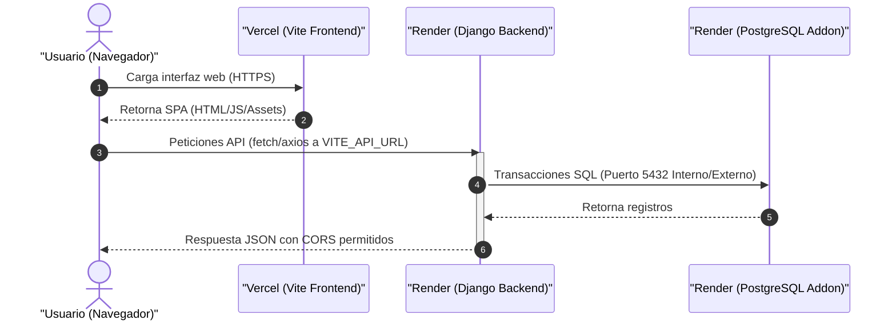
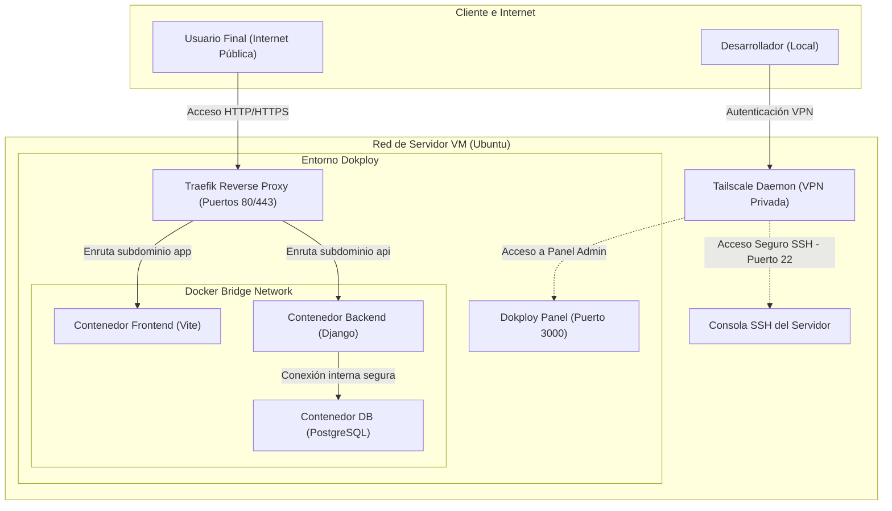
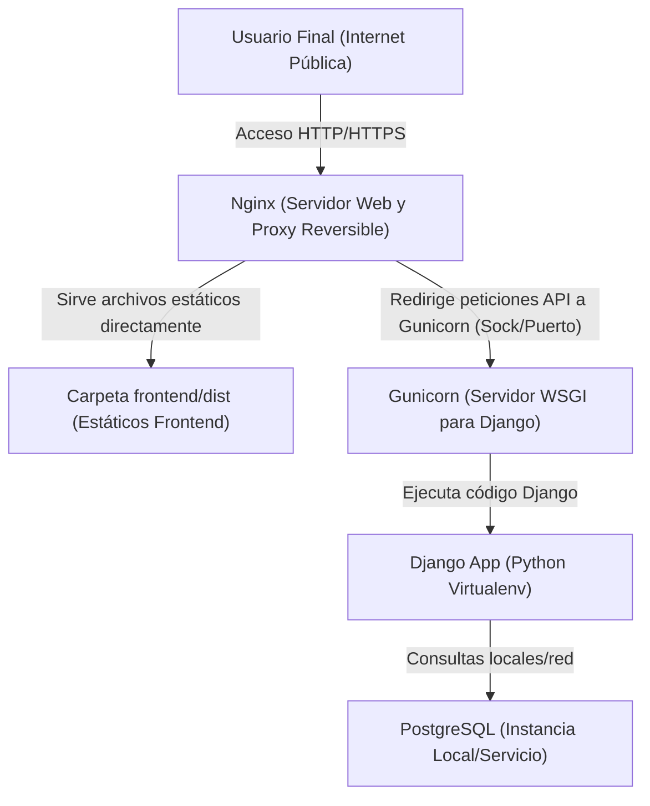
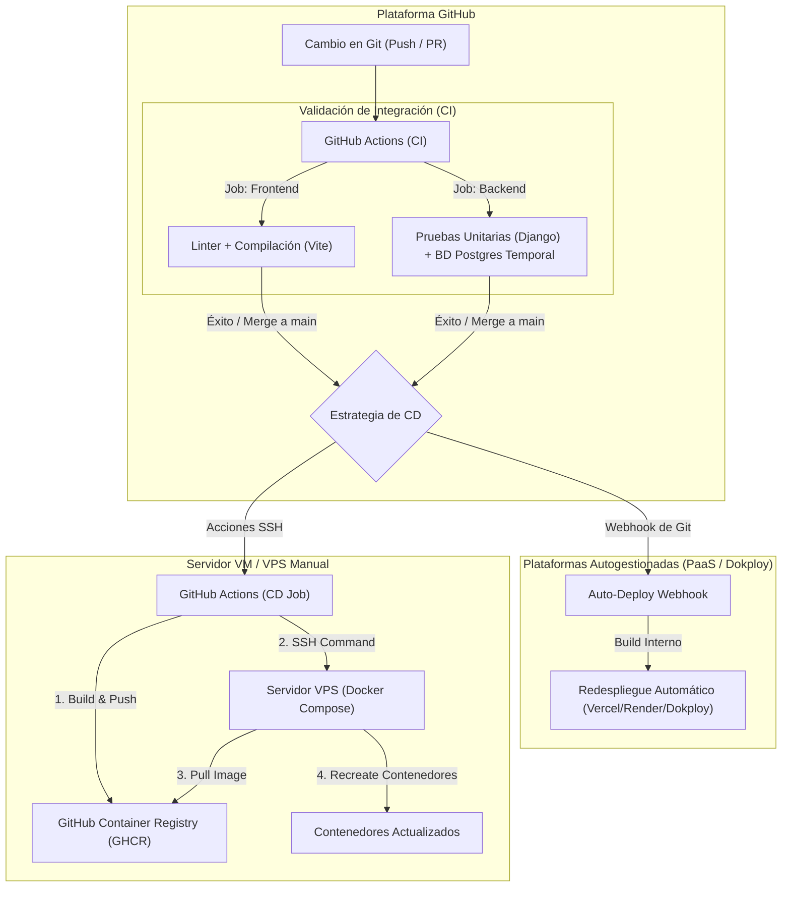
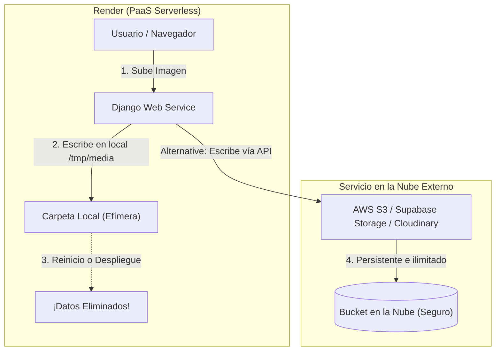
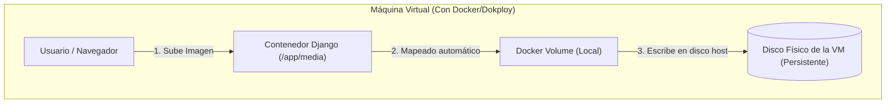
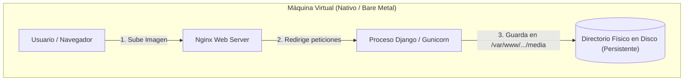

# Guía Detallada de Despliegue - ERP Progra Web

Esta guía contiene la documentación completa para desplegar el proyecto **ERP Progra Web** (Frontend en Vite y Backend en Django + PostgreSQL). Cubre los siguientes escenarios:

1. **Despliegue en Plataformas como Servicio (PaaS)** utilizando **Vercel** (Frontend) y **Render** (Backend y Base de Datos).
2. **Despliegue Autohospedado en VM con Contenedores** utilizando **Dokploy** y conectado de forma segura mediante **Tailscale**.
3. **Despliegue Autohospedado Directo en VM (Sin Contenedores)** configurando Nginx, Gunicorn y PostgreSQL directamente sobre el sistema operativo (opción alternativa, menos estable pero viable para recursos bajos).
4. **Casos Alternos y Resolución de Problemas** (incluyendo el bloqueo de DNS por parte de UFW en desarrollo local).

---

## 1. Arquitecturas de Despliegue

### Opción A: Despliegue en PaaS (Vercel + Render)

Es la opción más sencilla y mantenible sin administración de servidores. El tráfico público entra directamente a Vercel para el Frontend y a Render para el Backend.



---

### Opción B: Despliegue Autohospedado (VM + Dokploy + Tailscale)

Ideal para tener control total de la infraestructura a bajo costo. El acceso administrativo al servidor está restringido a una VPN privada (Tailscale) y los contenedores son administrados mediante la consola visual de Dokploy.



---

### Opción C: Despliegue Directo en VM (Sin Contenedores / Nginx + Gunicorn + Systemd)

Consiste en configurar e instalar todos los servicios (Django, PostgreSQL, Nginx y Gunicorn) directamente sobre el sistema operativo de la máquina virtual. Es **menos aislada, menos estable** y propensa a conflictos entre librerías o dependencias del sistema operativo, pero funciona bien en servidores con muy pocos recursos.



---

## 2. Gestión de Secretos y Variables de Entorno

Nunca se deben subir credenciales o secretos al control de versiones (Git). A continuación, se detalla qué variables requiere cada componente y dónde se configuran.

### Variables del Backend (Django)
Estas variables deben inyectarse en el contenedor de Django (Render o Dokploy):

| Variable | Descripción | Ejemplo / Valor |
| :--- | :--- | :--- |
| `SECRET_KEY` | Clave secreta para hashes y sesiones en Django. | Un string largo y aleatorio. |
| `DEBUG` | Activa/Desactiva el modo de depuración. **Debe ser False en producción**. | `False` |
| `ENABLE_API_DOCS` | Habilita/Deshabilita la generación de la documentación interactiva Swagger/Redoc. | `True` (Por defecto sigue a `DEBUG`) |
| `ENABLE_PUBLIC_STOREFRONT` | Habilita/Deshabilita el portal de tienda pública (Storefront). | `False` |
| `ALLOWED_HOSTS` | Dominios o IPs desde los cuales el servidor acepta peticiones. | `api.tudominio.com,tu-app.onrender.com` |
| `CORS_ALLOWED_ORIGINS` | Dominios autorizados para consumir el backend desde el navegador (CORS). | `https://tudominio.com,https://tu-app.vercel.app` |
| `POSTGRES_DB` | Nombre de la base de datos SQL. | `erp_db` |
| `POSTGRES_USER` | Usuario de la base de datos. | `erp_user` |
| `POSTGRES_PASSWORD` | Contraseña del usuario SQL. | *[Generar una contraseña fuerte]* |
| `POSTGRES_HOST` | Dirección de red del servidor PostgreSQL. | `db` (interno de Dokploy) o la URL de Render. |
| `POSTGRES_PORT` | Puerto de conexión a PostgreSQL. | `5432` |
| `MEDIA_URL` | URL pública bajo la cual se servirán los archivos de medios (imágenes/recibos). | `/media/` |
| `MEDIA_ROOT` | Ruta absoluta del sistema de archivos del servidor donde se guardarán los archivos de medios subidos. **Nota:** En Render el almacenamiento es efímero y se requiere configurar un servicio externo (ej. S3/Cloudinary) o un volumen persistente de pago. En VMs esto no ocurre (ver sección de almacenamiento). | `/tmp/media` o ruta persistente. |
| `EMAIL_HOST` | Servidor SMTP utilizado para enviar correos automáticos. | `smtp.gmail.com` |
| `EMAIL_PORT` | Puerto para la conexión SMTP. | `587` |
| `EMAIL_USE_TLS` | Indica si se debe utilizar una conexión TLS segura para el servidor SMTP. | `True` |
| `EMAIL_HOST_USER` | Usuario/Correo de autenticación del servidor SMTP. | `soporte@tudominio.com` |
| `EMAIL_HOST_PASSWORD` | Contraseña (o contraseña de aplicación) del servidor SMTP. | *[Token de aplicación o password]* |
| `DEFAULT_FROM_EMAIL` | Dirección de correo del remitente por defecto de la aplicación. | `alertas@tudominio.com` |
| `TURNSTILE_SECRET_KEY` | Clave secreta para la verificación en backend del CAPTCHA de Cloudflare Turnstile. | *[Clave secreta provista por Cloudflare]* |
| `DEMO_ADMIN_NAME` | Nombre inicial asignado al usuario Administrador creado mediante las semillas de base de datos. | `Super Admin` |
| `DEMO_ADMIN_EMAIL` | Correo electrónico inicial del Super Admin del sistema (semilla). | `admin@admin.com` |
| `DEMO_ADMIN_PASSWORD` | Contraseña inicial de acceso del Super Admin (semilla). | `admin` |

### Variables del Frontend (Vite)
Estas variables se compilan con la app al generar los archivos estáticos en Vercel o Dokploy:

| Variable | Descripción | Ejemplo / Valor |
| :--- | :--- | :--- |
| `VITE_API_URL` | URL base del backend de producción para las llamadas del cliente. | `https://tu-api.onrender.com/api` o `https://api.tudominio.com/api` |

---

## 3. Despliegue en PaaS (Vercel + Render)

### Paso 1: Configurar la Base de Datos en Render
1. Inicia sesión en [Render.com](https://render.com/).
2. Haz clic en **New** > **PostgreSQL**.
3. Asigna un nombre a la base de datos, selecciona la región más cercana a tus usuarios y selecciona el plan (el plan gratuito es suficiente para pruebas).
4. Haz clic en **Create Database**.
5. Una vez creada, copia la **Internal Database URL** (para uso de Render) o las credenciales individuales.

### Paso 2: Desplegar el Backend (Django) en Render
1. En Render, haz clic en **New** > **Web Service**.
2. Conecta tu repositorio de GitHub.
3. Configura los siguientes parámetros básicos:
   * **Language**: `Docker`
   * **Dockerfile Path**: `backend/Dockerfile` (Si tu estructura tiene el Dockerfile en ese subdirectorio).
   * **Region**: La misma de tu base de datos para minimizar latencia.
4. En la sección **Environment**, agrega las siguientes variables de entorno:
   * `SECRET_KEY`: *[Clave aleatoria]*
   * `DEBUG`: `False`
   * `ALLOWED_HOSTS`: `*` (o la URL de tu servicio web en Render).
   * `CORS_ALLOWED_ORIGINS`: La URL que te asigne Vercel en el frontend.
   * `POSTGRES_DB`, `POSTGRES_USER`, `POSTGRES_PASSWORD`, `POSTGRES_HOST`, `POSTGRES_PORT`: Llena con los datos provistos por la base de datos creada en el Paso 1.
5. Haz clic en **Deploy Web Service**.

### Paso 2.5: Almacenamiento Efímero de Archivos (Imágenes/Medios) en Render

> [!WARNING]
> **El Problema del Almacenamiento Efímero**
> Render utiliza contenedores con un **sistema de archivos efímero** (especialmente en la capa gratuita o Web Service estándar sin discos adjuntos). Cualquier archivo subido por los usuarios (como imágenes de productos o recibos de pago) se guardará en `/tmp/media` y **se eliminará por completo** cada vez que el contenedor de Render se reinicie, se suspenda por inactividad o se redespliegue con nuevo código.
>
> En un **despliegue en VM (Máquina Virtual / Dokploy)** (Sección 4), este problema **no ocurre** si se configuran volúmenes de Docker, ya que la VM posee un almacenamiento en disco persistente.

Para solucionar la pérdida de imágenes en Render, debes modificar la configuración de Django para utilizar un servicio de almacenamiento externo u optar por discos persistentes de pago:

#### Opción A: Usar un servicio de almacenamiento externo (Recomendado)
Consiste en configurar Django para subir los archivos de medios a un proveedor en la nube compatible con S3 (como **Amazon S3**, **Supabase Storage**, **Backblaze B2**, o **Cloudflare R2**), o bien usar **Cloudinary**.

**Pasos para implementar almacenamiento externo con S3 en Django:**

1. **Instalar dependencias en el Backend**:
   Añade al archivo `backend/requirements.txt`:
   ```text
   django-storages[amazon]>=1.14
   boto3>=1.34
   ```

2. **Modificar `backend/backend/settings.py`**:
   Configura el backend para alternar dinámicamente entre almacenamiento local (para desarrollo con `DEBUG=True`) y almacenamiento en S3 mediante variables de entorno:
   ```python
   # En backend/backend/settings.py
   
   USE_S3 = os.environ.get('USE_S3', 'False').lower() == 'true'

   if USE_S3:
       # Añadir 'storages' a las aplicaciones instaladas de forma dinámica
       if 'storages' not in INSTALLED_APPS:
           INSTALLED_APPS.append('storages')
       
       AWS_ACCESS_KEY_ID = os.environ.get('AWS_ACCESS_KEY_ID')
       AWS_SECRET_ACCESS_KEY = os.environ.get('AWS_SECRET_ACCESS_KEY')
       AWS_STORAGE_BUCKET_NAME = os.environ.get('AWS_STORAGE_BUCKET_NAME')
       AWS_S3_SIGNATURE_VERSION = 's3v4'
       AWS_S3_REGION_NAME = os.environ.get('AWS_S3_REGION_NAME', 'us-east-1')
       
       # Si usas Supabase o Cloudflare R2, inyecta su endpoint personalizado:
       AWS_S3_ENDPOINT_URL = os.environ.get('AWS_S3_ENDPOINT_URL')
       
       # Configurar Django >= 4.2 / 5.x / 6.0 para usar S3 para archivos de medios
       STORAGES = {
           "default": {
               "BACKEND": "storages.backends.s3boto3.S3Boto3Storage",
           },
           "staticfiles": {
               "BACKEND": "django.contrib.staticfiles.storage.StaticFilesStorage",
           },
       }
   else:
       # Configuración local por defecto
       MEDIA_URL = os.environ.get('MEDIA_URL', '/media/')
       default_media_root = BASE_DIR / 'media' if DEBUG else Path('/tmp/media')
       MEDIA_ROOT = Path(os.environ.get('MEDIA_ROOT', default_media_root))
   ```

3. **Configurar las Variables de Entorno en el panel de Render**:
   En el panel de control de tu Web Service en Render, agrega las siguientes variables de entorno:
   * `USE_S3`: `True`
   * `AWS_ACCESS_KEY_ID`: `*tu_access_key*`
   * `AWS_SECRET_ACCESS_KEY`: `*tu_secret_key*`
   * `AWS_STORAGE_BUCKET_NAME`: `*tu_nombre_de_bucket*`
   * `AWS_S3_REGION_NAME`: `*ej_us-east-1*`
   * `AWS_S3_ENDPOINT_URL`: `*url_endpoint*` (obligatorio para Supabase S3 API o Cloudflare R2; opcional para AWS S3)

---

#### Opción B: Usar Discos Persistentes de Render (De pago)
Si prefieres mantener los archivos locales en lugar de usar un bucket externo, puedes pagar por un volumen en Render:
1. En el panel del Web Service de Django en Render, haz clic en **Disks** > **Add Disk**.
2. Asígnale un nombre (ej. `erp-media`), define el tamaño (ej. `1 GB`) y la ruta de montaje (Mount Path) como `/var/lib/erp/media`.
3. Agrega la variable de entorno a tu servicio en Render:
   * `MEDIA_ROOT`: `/var/lib/erp/media`

---

### Paso 3: Desplegar el Frontend (Vite) en Vercel
1. Inicia sesión en [Vercel.com](https://vercel.com/).
2. Haz clic en **Add New** > **Project** e importa tu repositorio de GitHub.
3. Configura los directorios de compilación:
   * **Root Directory**: Cambiar a `frontend` si tu frontend está en esa subcarpeta.
   * **Framework Preset**: `Vite`
   * **Build Command**: `npm run build`
   * **Output Directory**: `dist`
4. Expande la pestaña **Environment Variables** y agrega:
   * `VITE_API_URL`: La URL pública del servicio web de Render (ej. `https://erp-backend.onrender.com`).
5. Haz clic en **Deploy**.

---

## 4. Despliegue Autohospedado en VM (Dokploy + Tailscale)

Esta opción permite levantar todo el stack en una máquina virtual propia (como AWS EC2, DigitalOcean Droplet o Hetzner Cloud) de forma segura.

### Paso 1: Configuración de Tailscale (Acceso SSH Seguro)
Para evitar exponer puertos críticos de gestión (SSH puerto 22 o el panel de Dokploy puerto 3000) a Internet abierta:

1. Crea una cuenta en [Tailscale](https://tailscale.com/).
2. Instala Tailscale en tu servidor VM ejecutando el comando de instalación rápida:
   ```bash
   curl -fsSL https://tailscale.com/install.sh | sh
   ```
3. Registra el servidor en tu red privada ejecutando:
   ```bash
   sudo tailscale up
   ```
4. Visita el link impreso en la terminal para autenticar el dispositivo.
5. Una vez conectado, el servidor recibirá una IP interna segura (ej. `100.x.y.z`).
6. **Configuración de seguridad**: Ahora puedes cerrar el puerto 22 en el firewall público del proveedor de nube y acceder al servidor únicamente mediante:
   ```bash
   ssh usuario@100.x.y.z
   ```

### Paso 2: Instalación de Dokploy
Dokploy es una alternativa auto-hospedable a Heroku/Render que gestiona contenedores a través de una interfaz web.

1. Conéctate a la VM por SSH usando la IP de Tailscale.
2. Ejecuta el script oficial de instalación de Dokploy en un sistema limpio (requiere Docker preinstalado o lo instalará automáticamente):
   ```bash
   curl -sSL https://dokploy.com/install.sh | sh
   ```
3. Al terminar la instalación, el panel estará disponible en el puerto `3000` de tu máquina.
4. **Acceso Seguro**: Dado que tienes Tailscale activo, no expongas el puerto `3000` públicamente en tu proveedor. Simplemente accede en tu navegador usando la IP de Tailscale de la VM:
   ```text
   http://100.x.y.z:3000
   ```
5. Regístrate creando el usuario administrador inicial.

### Paso 3: Crear la Base de Datos en Dokploy
1. En el panel de Dokploy, crea un nuevo **Project** y entra en él.
2. Haz clic en **Create Service** > **Database** > **PostgreSQL**.
3. Configura las credenciales deseadas (Base de datos, Usuario, Contraseña).
4. Guarda los cambios. Dokploy creará un contenedor de PostgreSQL seguro que correrá de fondo.

### Paso 4: Desplegar el Backend (Django) en Dokploy
1. Dentro del mismo proyecto, haz clic en **Create Service** > **Application**.
2. Configura los detalles de origen:
   * **Source**: GitHub (conecta tu repositorio).
   * **Branch**: `main` o `develop`.
3. Configura la forma de compilación:
   * **Build Type**: `Dockerfile`
   * **Dockerfile Path**: `backend/Dockerfile`
4. Ve a la pestaña **Environment Variables** y agrega las variables correspondientes descritas en la sección 2. Utiliza la dirección de red interna provista por Dokploy para conectar el backend al contenedor PostgreSQL (usualmente el nombre del servicio de base de datos dentro del clúster de Docker).
5. **Persistencia de Archivos (Medios/Imágenes)**: Dado que en una VM el almacenamiento del host es persistente, para evitar que las imágenes subidas se pierdan al recrear o actualizar el contenedor, ve a la pestaña **Volumes** en Dokploy, crea un volumen persistente de tipo local y configúralo para montar `/app/media` (o la ruta que definas en `MEDIA_ROOT`) en el contenedor.
6. Ve a la pestaña **Domains** para asociar un subdominio autogenerado o tu propio dominio (ej. `api.tudominio.com`). Dokploy/Traefik gestionará los certificados SSL automáticos de Let's Encrypt.
7. Haz clic en **Deploy**.

### Paso 5: Desplegar el Frontend (Vite) en Dokploy
1. Crea otra **Application** en Dokploy para el Frontend.
2. Selecciona la misma fuente de GitHub y rama.
3. Configura la compilación:
   * **Build Type**: `Nixpacks` o usa un Dockerfile en frontend.
   * **Root Directory**: `frontend`
4. Agrega la variable de entorno:
   * `VITE_API_URL`: La URL pública configurada para el backend en el Paso 4.
5. Asocia un dominio en la pestaña **Domains** (ej. `app.tudominio.com`).
6. Haz clic en **Deploy**.

---

## 5. Despliegue Autohospedado Directo en VM (Sin Contenedores)

> [!WARNING]
> **Advertencia sobre Estabilidad y Mantenibilidad**
> Ejecutar la aplicación directamente sobre el sistema operativo de la VM sin Docker ni Dokploy es una alternativa viable si la máquina virtual cuenta con recursos extremadamente limitados (como 512 MB de RAM). No obstante, es **menos estable**, ya que carece de aislamiento. Cualquier cambio en las dependencias globales del sistema o actualización del sistema operativo puede romper el entorno del backend o de la base de datos.

### Paso 1: Configurar el Entorno del Servidor
Conéctate por SSH a tu servidor e instala los paquetes necesarios para compilar y ejecutar Python, PostgreSQL y Nginx:
```bash
sudo apt update
sudo apt upgrade -y
sudo apt install -y python3-pip python3-venv python3-dev libpq-dev postgresql postgresql-contrib nginx curl git
```

### Paso 2: Configurar la Base de Datos PostgreSQL Local
1. Inicia sesión en la consola de PostgreSQL:
   ```bash
   sudo -i -u postgres psql
   ```
2. Crea la base de datos, el usuario y asígnale privilegios:
   ```sql
   CREATE DATABASE erp_db;
   CREATE USER erp_user WITH PASSWORD 'tu_contrasena_segura';
   ALTER ROLE erp_user SET client_encoding TO 'utf8';
   ALTER ROLE erp_user SET default_transaction_isolation TO 'read committed';
   ALTER ROLE erp_user SET timezone TO 'UTC';
   GRANT ALL PRIVILEGES ON DATABASE erp_db TO erp_user;
   \q
   ```

### Paso 3: Configurar el Backend (Django)
1. Clona el repositorio en el servidor (por ejemplo, en `/var/www/erp-progra-web`):
   ```bash
   sudo mkdir -p /var/www
   sudo chown -R $USER:$USER /var/www
   git clone https://github.com/tu-usuario/tu-repo.git /var/www/erp-progra-web
   cd /var/www/erp-progra-web/backend
   ```
2. Crea y activa un entorno virtual de Python:
   ```bash
   python3 -m venv venv
   source venv/bin/activate
   ```
3. Instala las dependencias:
   ```bash
   pip install --upgrade pip
   pip install -r requirements.txt gunicorn
   ```
4. Crea un archivo de configuración de variables de entorno `.env` en la carpeta `backend/` o configúralas a nivel de sistema. Se recomienda crear un archivo `.env` cargado por Django:
   ```env
   # /var/www/erp-progra-web/backend/.env
   DEBUG=False
   SECRET_KEY=clave_secreta_de_produccion_muy_larga
   ALLOWED_HOSTS=api.tudominio.com,tu_ip_publica
   CORS_ALLOWED_ORIGINS=https://app.tudominio.com
   POSTGRES_DB=erp_db
   POSTGRES_USER=erp_user
   POSTGRES_PASSWORD=tu_contrasena_segura
   POSTGRES_HOST=localhost
   POSTGRES_PORT=5432
   ```
5. Corre las migraciones y recopila los archivos estáticos:
   ```bash
   python manage.py migrate
   python manage.py collectstatic --noinput
   ```

### Paso 4: Configurar Gunicorn como un Servicio Systemd
Para que Django corra en segundo plano de manera continua y se inicie automáticamente con el sistema operativo, crea un servicio de Systemd:
1. Crea el archivo de servicio:
   ```bash
   sudo nano /etc/systemd/system/gunicorn.service
   ```
2. Añade el siguiente contenido (ajustando rutas y nombres de usuario):
   ```ini
   [Unit]
   Description=Gunicorn daemon para ERP Django
   After=network.target

   [Service]
   User=ubuntu
   WorkingDirectory=/var/www/erp-progra-web/backend
   ExecStart=/var/www/erp-progra-web/backend/venv/bin/gunicorn --access-logfile - --workers 3 --bind 127.0.0.1:8000 backend.wsgi:application

   [Install]
   WantedBy=multi-user.target
   ```
3. Inicia y habilita el servicio de Gunicorn:
   ```bash
   sudo systemctl start gunicorn
   sudo systemctl enable gunicorn
   ```

### Paso 5: Compilar y Servir el Frontend (Vite)
1. Instala Node.js (versión LTS) en el servidor utilizando Node Source o nvm.
2. Navega al directorio del frontend e instala las dependencias:
   ```bash
   cd /var/www/erp-progra-web/frontend
   npm install
   ```
3. Crea un archivo `.env.production` con la URL de tu API local:
   ```env
   VITE_API_URL=https://api.tudominio.com/api
   ```
4. Compila el frontend para producción:
   ```bash
   npm run build
   ```
   Esto generará una carpeta `dist/` en `frontend/` que contiene los archivos estáticos listos para ser servidos por Nginx.

### Paso 6: Configurar Nginx como Servidor Web y Reverse Proxy
Nginx servirá los archivos del frontend de forma directa y redirigirá las peticiones de la API `/api/` y el panel de administración `/admin/` hacia Gunicorn.
1. Crea un archivo de configuración en Nginx:
   ```bash
   sudo nano /etc/nginx/sites-available/erp
   ```
2. Añade la configuración básica (reemplaza dominios e IPs):
   ```nginx
   server {
       listen 80;
       server_name app.tudominio.com;

       # Frontend estático
       location / {
           root /var/www/erp-progra-web/frontend/dist;
           try_files $uri $uri/ /index.html;
       }
   }

   server {
       listen 80;
       server_name api.tudominio.com;

       # Archivos estáticos de Django (admin, etc.)
       location /static/ {
           alias /var/www/erp-progra-web/backend/staticfiles/;
       }

       # Archivos subidos por los usuarios (Medios/Imágenes)
       location /media/ {
           alias /var/www/erp-progra-web/backend/media/;
       }

       # Proxy para Django Backend (Gunicorn)
       location / {
           proxy_set_header Host $http_host;
           proxy_set_header X-Real-IP $remote_addr;
           proxy_set_header X-Forwarded-For $proxy_add_x_forwarded_for;
           proxy_set_header X-Forwarded-Proto $scheme;
           proxy_pass http://127.0.0.1:8000;
       }
   }
   ```
3. Habilita el sitio y recarga Nginx:
   ```bash
   sudo ln -s /etc/nginx/sites-available/erp /etc/nginx/sites-enabled/
   sudo nginx -t
   sudo systemctl restart nginx
   ```
4. **Seguridad SSL**: Se recomienda instalar Certbot para configurar certificados HTTPS de Let's Encrypt automáticos para ambos dominios:
   ```bash
   sudo apt install -y certbot python3-certbot-nginx
   sudo certbot --nginx -d app.tudominio.com -d api.tudominio.com
   ```

### Nota sobre Persistencia de Imágenes en Despliegue Local Directo
A diferencia de Render, dado que los servicios se ejecutan de manera directa en el disco físico de la VM, la carpeta `/media/` en `/var/www/erp-progra-web/backend/media/` es **100% persistente** por defecto. No requieres configurar almacenamiento en la nube externo (como S3 o Cloudinary) para evitar que se borren, a menos que decidas usarlo para liberar espacio del disco local de la VM.

---

## 6. Casos Alternos y Solución de Problemas

### Fallo local por Firewall (UFW) en Linux
Si levantas el entorno de desarrollo local con `docker compose up --build` y observas el siguiente error en la terminal del backend:

```text
django.db.utils.OperationalError: could not translate host name "db" to address: Name or service not known
```

Esto ocurre porque el cortafuegos **UFW** está bloqueando la comunicación a través del puente de red virtual creado por Docker. UFW por defecto bloquea la política de reenvío (*Forwarding*), interrumpiendo el servidor DNS interno de Docker (`127.0.0.11`).

#### Solución Definitiva en tu Linux Local:
1. Edita la configuración por defecto de UFW:
   ```bash
   sudo nano /etc/default/ufw
   ```
2. Busca la línea:
   ```text
   DEFAULT_FORWARD_POLICY="DROP"
   ```
3. Cámbiala a:
   ```text
   DEFAULT_FORWARD_POLICY="ACCEPT"
   ```
4. Guarda y cierra el archivo (`Ctrl + O`, `Enter`, `Ctrl + X`).
5. Recarga el firewall para aplicar el cambio:
   ```bash
   sudo ufw reload
   ```
6. Reinicia el servicio de Docker para regenerar las reglas de iptables:
   ```bash
   sudo systemctl restart docker
   ```
7. Recrea los contenedores en tu proyecto:
   ```bash
   docker compose down
   docker network prune -f
   docker compose up --build
   ```

### Problemas comunes en Producción

#### 1. Error de CORS en el Navegador
* **Síntoma**: Peticiones bloqueadas por CORS al intentar iniciar sesión o cargar datos desde el frontend.
* **Causa**: El backend no tiene configurado el origen del frontend en `CORS_ALLOWED_ORIGINS` o falta `django-cors-headers` en las aplicaciones instaladas.
* **Solución**: Asegúrate de que `CORS_ALLOWED_ORIGINS` contenga la URL exacta del frontend (incluyendo `https://` y sin barra diagonal `/` al final).

#### 2. Migraciones de Base de Datos no ejecutadas
* **Síntoma**: Tablas inexistentes (`Relation "users_user" does not exist`).
* **Solución en Dokploy/Render**: Asegúrate de que el comando de arranque del contenedor corra primero las migraciones. En Render, se recomienda configurar el comando de arranque como:
  ```bash
  sh -c "python manage.py migrate && gunicorn core.wsgi:application"
  ```
  *(Reemplaza `core.wsgi` por el nombre de la carpeta de configuración de tu Django, por ejemplo `backend.wsgi`).*

---

## 7. Sobrescribir Configuración de Docker para Producción (Sin Valores Hardcodeados)

El archivo `docker-compose.yml` por defecto en la raíz está diseñado para **desarrollo local**. Tiene credenciales de prueba quemadas (*hardcoded*), monta carpetas locales usando `volumes` para recarga en caliente y ejecuta servidores de desarrollo (`runserver` de Django y `npm run dev` de Vite).

Para desplegar en producción sin quemar credenciales en el código y sin depender de carpetas compartidas del host, se recomiendan las siguientes técnicas de sobrescritura:

### Estrategia A: Interpolación con Archivo `.env` (Recomendado)

En lugar de definir credenciales directamente en el bloque `environment`, utiliza la sintaxis `${VARIABLE}` en tu `docker-compose.yml`. Docker Compose leerá automáticamente un archivo `.env` ubicado en el mismo directorio e inyectará esos valores al levantar los contenedores.

#### Modificación del `docker-compose.yml` para Producción:
```yaml
services:
  db:
    image: postgres:17
    volumes:
      - postgres_data:/var/lib/postgresql/data
    environment:
      - POSTGRES_DB=${POSTGRES_DB}
      - POSTGRES_USER=${POSTGRES_USER}
      - POSTGRES_PASSWORD=${POSTGRES_PASSWORD}
    # En producción se recomienda no exponer el puerto 5432 a internet abierta
    # ports:
    #   - "5432:5432"

  backend:
    build: backend/
    command: sh -c "python manage.py migrate && gunicorn backend.wsgi:application --bind 0.0.0.0:8000"
    depends_on:
      db:
        condition: service_healthy
    environment:
      - POSTGRES_DB=${POSTGRES_DB}
      - POSTGRES_USER=${POSTGRES_USER}
      - POSTGRES_PASSWORD=${POSTGRES_PASSWORD}
      - POSTGRES_HOST=db
      - POSTGRES_PORT=5432
      - SECRET_KEY=${SECRET_KEY}
      - DEBUG=${DEBUG}
      - CORS_ALLOWED_ORIGINS=${CORS_ALLOWED_ORIGINS}
```

En el servidor de producción, se crea un archivo `.env` privado al lado de `docker-compose.yml`:
```env
POSTGRES_DB=erp_prod_db
POSTGRES_USER=admin_seguro
POSTGRES_PASSWORD=contrasena_altamente_segura_123
SECRET_KEY=clave_secreta_de_produccion_muy_larga_y_compleja
DEBUG=False
CORS_ALLOWED_ORIGINS=https://app.tudominio.com
```

---

### Estrategia B: Composición de Archivos (Multi-file Compose)

Para mantener limpios ambos entornos sin duplicar código, puedes separar la configuración en múltiples archivos YAML. Docker Compose permite fusionar múltiples archivos al ejecutar comandos.

1. **`docker-compose.yml` (Base de Producción)**: Contiene la definición pura de servicios sin montajes locales y configurado con comandos seguros (ej. Gunicorn).
2. **`docker-compose.override.yml` (Desarrollo Local)**: Añade las configuraciones de desarrollo (volúmenes locales, puertos expuestos y comandos `runserver`/`dev`). *Por defecto, Docker Compose carga este archivo de forma automática localmente*.

#### 1. Archivo Base (`docker-compose.yml`)
```yaml
services:
  db:
    image: postgres:17
    volumes:
      - postgres_data:/var/lib/postgresql/data
    environment:
      - POSTGRES_DB=${POSTGRES_DB}
      - POSTGRES_USER=${POSTGRES_USER}
      - POSTGRES_PASSWORD=${POSTGRES_PASSWORD}

  backend:
    build: backend/
    command: sh -c "python manage.py migrate && gunicorn backend.wsgi:application --bind 0.0.0.0:8000"
    depends_on:
      db:
        condition: service_healthy
    environment:
      - POSTGRES_DB=${POSTGRES_DB}
      - POSTGRES_USER=${POSTGRES_USER}
      - POSTGRES_PASSWORD=${POSTGRES_PASSWORD}
      - POSTGRES_HOST=db
      - POSTGRES_PORT=5432
      - SECRET_KEY=${SECRET_KEY}
      - DEBUG=False

  frontend:
    build: frontend/
    # En producción se compilaría a estáticos y se serviría mediante Nginx/Caddy
```

#### 2. Sobrescritura Local (`docker-compose.override.yml`)
Este archivo agrega montajes locales y comandos de desarrollo en la máquina local:
```yaml
services:
  db:
    ports:
      - "5432:5432"

  backend:
    command: python manage.py runserver 0.0.0.0:8000
    ports:
      - "8000:8000"
    volumes:
      - ./backend:/app
    environment:
      - DEBUG=True

  frontend:
    command: npm run dev
    ports:
      - "5173:5173"
    volumes:
      - ./frontend:/app
      - /app/node_modules
    environment:
      - VITE_API_URL=http://localhost:8000/api
```

#### Instrucciones de Ejecución:
* **En desarrollo local**: Ejecuta simplemente `docker compose up --build`. Docker Compose fusionará automáticamente `docker-compose.yml` y `docker-compose.override.yml`.
* **En el servidor de producción**: Sube únicamente `docker-compose.yml` y tu archivo `.env`. Ejecuta el comando especificando el archivo base para evitar que busque configuraciones de desarrollo:
  ```bash
  docker compose -f docker-compose.yml up -d --build
  ```

---

## 8. Automatización y CI/CD (Integración y Despliegue Continuo)

Automatizar el flujo desde que guardas un cambio en Git hasta que se despliega en producción reduce errores humanos y garantiza que el código subido siempre sea funcional y compile sin errores.



### 7.1. Integración Continua (CI): Validación de Código

Para asegurar la calidad del código, puedes configurar un workflow de GitHub Actions que valide el backend y frontend en cada Pull Request o push a `develop` y `main`.

Crea el archivo `.github/workflows/ci.yml` con el siguiente contenido:

```yaml
name: CI (Integración Continua)

on:
  push:
    branches: [ main, develop ]
  pull_request:
    branches: [ main, develop ]

jobs:
  backend-test:
    runs-on: ubuntu-latest
    services:
      postgres:
        image: postgres:17
        env:
          POSTGRES_DB: erp_test_db
          POSTGRES_USER: erp_test_user
          POSTGRES_PASSWORD: erp_test_password
        ports:
          - 5432:5432
        options: >-
          --health-cmd pg_isready
          --health-interval 10s
          --health-timeout 5s
          --health-retries 5

    steps:
      - name: Descargar Código
        uses: actions/checkout@v4

      - name: Configurar Python
        uses: actions/setup-python@v5
        with:
          python-version: '3.12'

      - name: Instalar Dependencias
        run: |
          python -m pip install --upgrade pip
          pip install -r backend/requirements.txt

      - name: Correr Pruebas Unitarias
        env:
          POSTGRES_DB: erp_test_db
          POSTGRES_USER: erp_test_user
          POSTGRES_PASSWORD: erp_test_password
          POSTGRES_HOST: localhost
          POSTGRES_PORT: 5432
          SECRET_KEY: django-insecure-test-key
          DEBUG: False
        run: |
          cd backend
          python manage.py test

  frontend-build:
    runs-on: ubuntu-latest
    steps:
      - name: Descargar Código
        uses: actions/checkout@v4

      - name: Configurar Node.js
        uses: actions/setup-node@v4
        with:
          node-version: '22'

      - name: Instalar Dependencias
        run: |
          cd frontend
          npm ci

      - name: Validar Linter (ESLint)
        run: |
          cd frontend
          npm run lint

      - name: Validar Compilación de Producción
        run: |
          cd frontend
          npm run build
```

---

### 7.2. Despliegue Continuo (CD) en Entornos Administrados (PaaS / Dokploy)

Tanto **Render**, **Vercel** como **Dokploy** cuentan con mecanismos integrados para redesplegar automáticamente cuando hay cambios en el repositorio de GitHub. No es necesario escribir pipelines complejos para esto.

#### Opción A: Despliegue en Render y Vercel (Auto-deploy)
1. **Render (Backend)**:
   * Al crear tu Web Service en Render, por defecto la opción **Auto-Deploy** está configurada en `Yes`.
   * Cada vez que hagas `git push` a la rama de origen (ej. `develop` o `main`), Render compilará tu Dockerfile y redesplegará el contenedor de forma automática sin caída de servicio (Zero-Downtime).
2. **Vercel (Frontend)**:
   * Vercel detecta de forma nativa los pushes al repositorio conectado de GitHub.
   * Generará despliegues automáticos previos (Preview) para ramas de desarrollo y un despliegue final de Producción cuando se integren cambios en la rama principal (`main`).

#### Opción B: Despliegue en Dokploy (Git Webhooks)
Dokploy permite configurar un webhook para escuchar eventos de GitHub:
1. En tu panel de Dokploy, navega a tu **Application** (ej. backend o frontend).
2. Entra en la pestaña **Deployments** o **Git**.
3. Activa la opción de **Autodeploy** o copia la **Webhook URL** generada por Dokploy.
4. Ve a tu repositorio de GitHub > **Settings** > **Webhooks** > **Add webhook**.
5. Pega la URL provista por Dokploy, selecciona `application/json` en Content type, y define el disparador en el evento de "Just the push event".
6. Al presionar **Add webhook**, cada push a la rama iniciará un nuevo despliegue automático en Dokploy.

---

### 7.3. Despliegue Continuo (CD) Directo en VM/VPS (GitHub Actions + SSH)

Si no utilizas Dokploy y estás administrando tu propia VM usando el archivo `docker-compose.yml` para producción, puedes automatizar el despliegue compilando las imágenes en GitHub y desplegándolas vía SSH.

#### Requisitos en GitHub:
Debes guardar las credenciales del servidor en **Settings** > **Secrets and variables** > **Actions** de tu repositorio en GitHub:
* `SSH_HOST`: La IP pública de tu servidor (o la IP de Tailscale si configuras el Runner para conectarse a ella).
* `SSH_USER`: El usuario del servidor (ej. `ubuntu`, `root`).
* `SSH_KEY`: Tu clave privada SSH (contenido de tu archivo `id_rsa` o `id_ed25519` local que tenga acceso al servidor).

#### Archivo `.github/workflows/deploy.yml`:
```yaml
name: CD (Despliegue Continuo)

on:
  push:
    branches: [ main ]  # Solo desplegar al unir cambios en la rama principal

jobs:
  build-and-deploy:
    runs-on: ubuntu-latest
    steps:
      - name: Descargar Código
        uses: actions/checkout@v4

      - name: Iniciar Sesión en GitHub Packages (GHCR)
        uses: docker/login-action@v3
        with:
          registry: ghcr.io
          username: ${{ github.actor }}
          password: ${{ secrets.GITHUB_TOKEN }}

      - name: Compilar y Subir Imagen Backend
        uses: docker/build-push-action@v5
        with:
          context: ./backend
          push: true
          tags: ghcr.io/${{ github.repository }}/backend:latest

      - name: Compilar y Subir Imagen Frontend
        uses: docker/build-push-action@v5
        with:
          context: ./frontend
          push: true
          tags: ghcr.io/${{ github.repository }}/frontend:latest

      - name: Desplegar en Servidor vía SSH
        uses: appleboy/ssh-action@v1.0.3
        with:
          host: ${{ secrets.SSH_HOST }}
          username: ${{ secrets.SSH_USER }}
          key: ${{ secrets.SSH_KEY }}
          script: |
            cd /ruta/a/tu/proyecto
            # Iniciar sesión en GHCR dentro del servidor si es privado
            echo "${{ secrets.GITHUB_TOKEN }}" | docker login ghcr.io -u ${{ github.actor }} --password-stdin
            # Descargar nuevas imágenes de contenedores
            docker compose pull
            # Levantar de nuevo en segundo plano recreando los modificados
            docker compose -f docker-compose.yml up -d --build
```

---

## 9. Comparativa General de Arquitecturas (Serverless vs. VM)

Para facilitar la toma de decisiones, a continuación se detallan las diferencias clave entre los tres esquemas de despliegue analizados en esta guía.

### 9.1. Tabla Comparativa de Características

| Característica | Opción A: PaaS (Vercel + Render) | Opción B: VM + Dokploy (Contenedores) | Opción C: VM Directo (Sin Contenedores) |
| :--- | :--- | :--- | :--- |
| **Tipo de Infraestructura** | Serverless / PaaS Gestionado | IaaS (Máquina Virtual) + Orquestador | IaaS (Máquina Virtual) Bare OS |
| **Persistencia de Archivos** | **Efímera** (Se borra al reiniciar). Requiere almacenamiento externo (S3/Cloudinary) o disco de pago. | **Persistente** a través de Volúmenes de Docker vinculados al disco de la VM. | **Persistente** de forma nativa en el sistema de archivos del disco local. |
| **Base de Datos** | Servidor gestionado por Render (cero administración). | Contenedor PostgreSQL dentro de la red interna de Docker. | Servicio nativo de PostgreSQL instalado en el sistema operativo. |
| **Estabilidad del Entorno** | **Alta**: Aislado por Render, sin riesgos por actualizaciones del sistema operativo. | **Alta**: Los contenedores aíslan las dependencias y evitan "romper" otros servicios. | **Baja**: Menos estable. Cambios en paquetes del sistema operativo pueden dañar la app. |
| **Escalabilidad** | **Sencilla**: Escala horizontal/vertical con unos clics en la interfaz de Render. | **Media**: Limitado por los recursos físicos de la VM (escala vertical fácilmente). | **Compleja**: Requiere reconfigurar Nginx, Gunicorn y la VM de forma manual. |
| **Costo** | **Variable**: Gratis para pruebas, pero costoso al añadir persistencia, BD más grandes o tráfico. | **Fijo y Bajo**: Costo fijo de la VM (ej. $5-$10/mes en DigitalOcean/Hetzner). | **Fijo y Bajo**: Igual que Opción B, optimiza al máximo los recursos al no correr Docker. |
| **Complejidad de Configuración** | **Baja**: Ideal para despliegues rápidos y bajo mantenimiento. | **Media**: Requiere configurar Dokploy y Tailscale una única vez. | **Alta**: Configuración manual de Nginx, Systemd, sockets y permisos. |

---

### 9.2. Flujos de Almacenamiento y Persistencia de Medios

Los siguientes diagramas ilustran cómo maneja cada arquitectura las subidas de archivos (imágenes, recibos, fotos de productos):

#### A. Almacenamiento en Render (Serverless / Contenedores Efímeros)
En Render, el almacenamiento es **efímero** por defecto. Si guardas un archivo en el disco del contenedor, se perderá. Debes configurar un almacenamiento persistente externo (ej. AWS S3) o adquirir un volumen de pago.



#### B. Almacenamiento en VM con Dokploy (Docker Volumes)
Al usar Docker en una VM, el almacenamiento del contenedor es efímero, pero Docker permite montar un **Volumen** local. El volumen mapea la carpeta del contenedor al disco persistente de la VM.



#### C. Almacenamiento en VM Directa (Sin Contenedores)
Al correr Django directamente en el sistema operativo con Gunicorn y Nginx, la carpeta `/media/` está en el disco duro físico de la VM, por lo que es **persistente por defecto** sin configuraciones adicionales.




