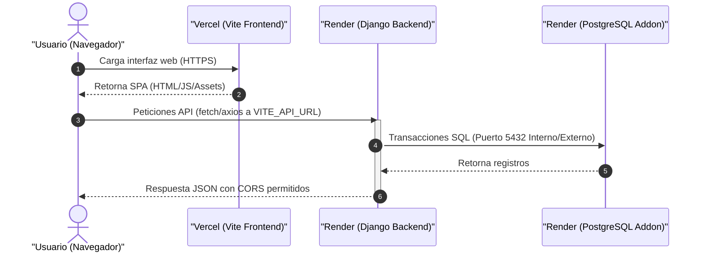
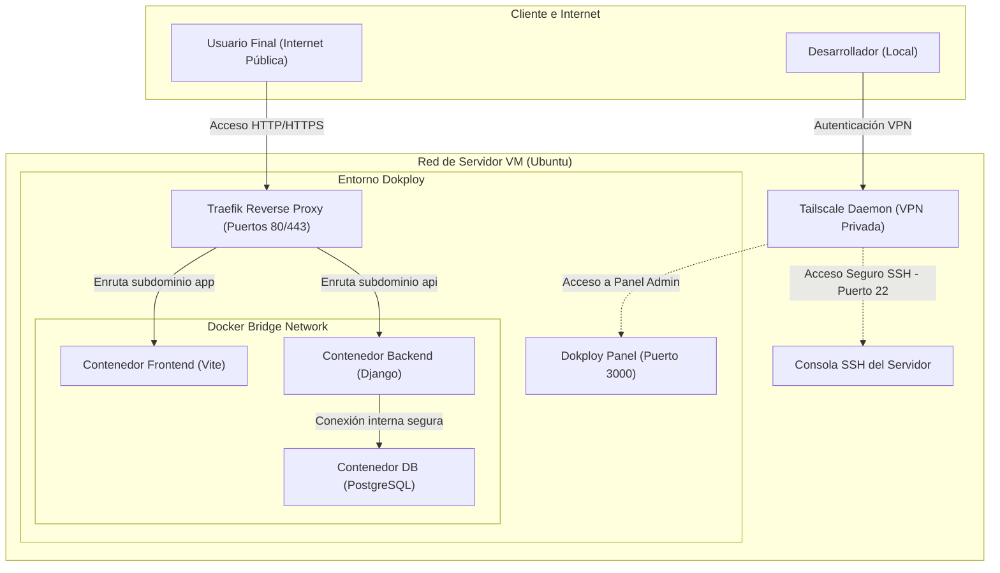

# Guía Detallada de Despliegue - ERP Progra Web

Esta guía contiene la documentación completa para desplegar el proyecto **ERP Progra Web** (Frontend en Vite y Backend en Django + PostgreSQL). Cubre dos escenarios principales:

1. **Despliegue en Plataformas como Servicio (PaaS)** utilizando **Vercel** (Frontend) y **Render** (Backend y Base de Datos).
2. **Despliegue Autohospedado (Self-Hosted)** en una Máquina Virtual (VM) privada utilizando **Dokploy** y conectada de forma segura mediante **Tailscale**.
3. **Casos Alternos y Resolución de Problemas** (incluyendo el bloqueo de DNS por parte de UFW en desarrollo local).

---

## 1. Arquitecturas de Despliegue

### Opción A: Despliegue en PaaS (Vercel + Render)

Es la opción más sencilla y mantenible sin administración de servidores. El tráfico público entra directamente a Vercel para el Frontend y a Render para el Backend.



---

### Opción B: Despliegue Autohospedado (VM + Dokploy + Tailscale)

Ideal para tener control total de la infraestructura a bajo costo. El acceso administrativo al servidor está restringido a una VPN privada (Tailscale) y los contenedores son administrados mediante la consola visual de Dokploy.



---

## 2. Gestión de Secretos y Variables de Entorno

Nunca se deben subir credenciales o secretos al control de versiones (Git). A continuación, se detalla qué variables requiere cada componente y dónde se configuran.

### Variables del Backend (Django)
Estas variables deben inyectarse en el contenedor de Django (Render o Dokploy):

| Variable | Descripción | Ejemplo / Valor |
| :--- | :--- | :--- |
| `SECRET_KEY` | Clave secreta para hashes y sesiones en Django. | Un string largo y aleatorio. |
| `DEBUG` | Activa/Desactiva el modo de depuración. **Debe ser False en producción**. | `False` |
| `ALLOWED_HOSTS` | Dominios o IPs desde los cuales el servidor acepta peticiones. | `api.tudominio.com,tu-app.onrender.com` |
| `CORS_ALLOWED_ORIGINS` | Dominios autorizados para consumir el backend desde el navegador. | `https://tudominio.com,https://tu-app.vercel.app` |
| `POSTGRES_DB` | Nombre de la base de datos SQL. | `erp_db` |
| `POSTGRES_USER` | Usuario de la base de datos. | `erp_user` |
| `POSTGRES_PASSWORD` | Contraseña del usuario SQL. | *[Generar una contraseña fuerte]* |
| `POSTGRES_HOST` | Dirección de red del servidor PostgreSQL. | `db` (interno de Dokploy) o la URL de Render. |
| `POSTGRES_PORT` | Puerto de conexión a PostgreSQL. | `5432` |

### Variables del Frontend (Vite)
Estas variables se compilan con la app al generar los archivos estáticos en Vercel o Dokploy:

| Variable | Descripción | Ejemplo / Valor |
| :--- | :--- | :--- |
| `VITE_API_URL` | URL base del backend de producción para las llamadas del cliente. | `https://tu-api.onrender.com/api` o `https://api.tudominio.com/api` |

---

## 3. Despliegue en PaaS (Vercel + Render)

### Paso 1: Configurar la Base de Datos en Render
1. Inicia sesión en [Render.com](https://render.com/).
2. Haz clic en **New** > **PostgreSQL**.
3. Asigna un nombre a la base de datos, selecciona la región más cercana a tus usuarios y selecciona el plan (el plan gratuito es suficiente para pruebas).
4. Haz clic en **Create Database**.
5. Una vez creada, copia la **Internal Database URL** (para uso de Render) o las credenciales individuales.

### Paso 2: Desplegar el Backend (Django) en Render
1. En Render, haz clic en **New** > **Web Service**.
2. Conecta tu repositorio de GitHub.
3. Configura los siguientes parámetros básicos:
   * **Language**: `Docker`
   * **Dockerfile Path**: `backend/Dockerfile` (Si tu estructura tiene el Dockerfile en ese subdirectorio).
   * **Region**: La misma de tu base de datos para minimizar latencia.
4. En la sección **Environment**, agrega las siguientes variables de entorno:
   * `SECRET_KEY`: *[Clave aleatoria]*
   * `DEBUG`: `False`
   * `ALLOWED_HOSTS`: `*` (o la URL de tu servicio web en Render).
   * `CORS_ALLOWED_ORIGINS`: La URL que te asigne Vercel en el frontend.
   * `POSTGRES_DB`, `POSTGRES_USER`, `POSTGRES_PASSWORD`, `POSTGRES_HOST`, `POSTGRES_PORT`: Llena con los datos provistos por la base de datos creada en el Paso 1.
5. Haz clic en **Deploy Web Service**.

### Paso 3: Desplegar el Frontend (Vite) en Vercel
1. Inicia sesión en [Vercel.com](https://vercel.com/).
2. Haz clic en **Add New** > **Project** e importa tu repositorio de GitHub.
3. Configura los directorios de compilación:
   * **Root Directory**: Cambiar a `frontend` si tu frontend está en esa subcarpeta.
   * **Framework Preset**: `Vite`
   * **Build Command**: `npm run build`
   * **Output Directory**: `dist`
4. Expande la pestaña **Environment Variables** y agrega:
   * `VITE_API_URL`: La URL pública del servicio web de Render (ej. `https://erp-backend.onrender.com`).
5. Haz clic en **Deploy**.

---

## 4. Despliegue Autohospedado en VM (Dokploy + Tailscale)

Esta opción permite levantar todo el stack en una máquina virtual propia (como AWS EC2, DigitalOcean Droplet o Hetzner Cloud) de forma segura.

### Paso 1: Configuración de Tailscale (Acceso SSH Seguro)
Para evitar exponer puertos críticos de gestión (SSH puerto 22 o el panel de Dokploy puerto 3000) a Internet abierta:

1. Crea una cuenta en [Tailscale](https://tailscale.com/).
2. Instala Tailscale en tu servidor VM ejecutando el comando de instalación rápida:
   ```bash
   curl -fsSL https://tailscale.com/install.sh | sh
   ```
3. Registra el servidor en tu red privada ejecutando:
   ```bash
   sudo tailscale up
   ```
4. Visita el link impreso en la terminal para autenticar el dispositivo.
5. Una vez conectado, el servidor recibirá una IP interna segura (ej. `100.x.y.z`).
6. **Configuración de seguridad**: Ahora puedes cerrar el puerto 22 en el firewall público del proveedor de nube y acceder al servidor únicamente mediante:
   ```bash
   ssh usuario@100.x.y.z
   ```

### Paso 2: Instalación de Dokploy
Dokploy es una alternativa auto-hospedable a Heroku/Render que gestiona contenedores a través de una interfaz web.

1. Conéctate a la VM por SSH usando la IP de Tailscale.
2. Ejecuta el script oficial de instalación de Dokploy en un sistema limpio (requiere Docker preinstalado o lo instalará automáticamente):
   ```bash
   curl -sSL https://dokploy.com/install.sh | sh
   ```
3. Al terminar la instalación, el panel estará disponible en el puerto `3000` de tu máquina.
4. **Acceso Seguro**: Dado que tienes Tailscale activo, no expongas el puerto `3000` públicamente en tu proveedor. Simplemente accede en tu navegador usando la IP de Tailscale de la VM:
   ```text
   http://100.x.y.z:3000
   ```
5. Regístrate creando el usuario administrador inicial.

### Paso 3: Crear la Base de Datos en Dokploy
1. En el panel de Dokploy, crea un nuevo **Project** y entra en él.
2. Haz clic en **Create Service** > **Database** > **PostgreSQL**.
3. Configura las credenciales deseadas (Base de datos, Usuario, Contraseña).
4. Guarda los cambios. Dokploy creará un contenedor de PostgreSQL seguro que correrá de fondo.

### Paso 4: Desplegar el Backend (Django) en Dokploy
1. Dentro del mismo proyecto, haz clic en **Create Service** > **Application**.
2. Configura los detalles de origen:
   * **Source**: GitHub (conecta tu repositorio).
   * **Branch**: `main` o `develop`.
3. Configura la forma de compilación:
   * **Build Type**: `Dockerfile`
   * **Dockerfile Path**: `backend/Dockerfile`
4. Ve a la pestaña **Environment Variables** y agrega las variables correspondientes descritas en la sección 2. Utiliza la dirección de red interna provista por Dokploy para conectar el backend al contenedor PostgreSQL (usualmente el nombre del servicio de base de datos dentro del clúster de Docker).
5. Ve a la pestaña **Domains** para asociar un subdominio autogenerado o tu propio dominio (ej. `api.tudominio.com`). Dokploy/Traefik gestionará los certificados SSL automáticos de Let's Encrypt.
6. Haz clic en **Deploy**.

### Paso 5: Desplegar el Frontend (Vite) en Dokploy
1. Crea otra **Application** en Dokploy para el Frontend.
2. Selecciona la misma fuente de GitHub y rama.
3. Configura la compilación:
   * **Build Type**: `Nixpacks` o usa un Dockerfile en frontend.
   * **Root Directory**: `frontend`
4. Agrega la variable de entorno:
   * `VITE_API_URL`: La URL pública configurada para el backend en el Paso 4.
5. Asocia un dominio en la pestaña **Domains** (ej. `app.tudominio.com`).
6. Haz clic en **Deploy**.

---

## 5. Casos Alternos y Solución de Problemas

### Fallo local por Firewall (UFW) en Linux
Si levantas el entorno de desarrollo local con `docker compose up --build` y observas el siguiente error en la terminal del backend:

```text
django.db.utils.OperationalError: could not translate host name "db" to address: Name or service not known
```

Esto ocurre porque el cortafuegos **UFW** está bloqueando la comunicación a través del puente de red virtual creado por Docker. UFW por defecto bloquea la política de reenvío (*Forwarding*), interrumpiendo el servidor DNS interno de Docker (`127.0.0.11`).

#### Solución Definitiva en tu Linux Local:
1. Edita la configuración por defecto de UFW:
   ```bash
   sudo nano /etc/default/ufw
   ```
2. Busca la línea:
   ```text
   DEFAULT_FORWARD_POLICY="DROP"
   ```
3. Cámbiala a:
   ```text
   DEFAULT_FORWARD_POLICY="ACCEPT"
   ```
4. Guarda y cierra el archivo (`Ctrl + O`, `Enter`, `Ctrl + X`).
5. Recarga el firewall para aplicar el cambio:
   ```bash
   sudo ufw reload
   ```
6. Reinicia el servicio de Docker para regenerar las reglas de iptables:
   ```bash
   sudo systemctl restart docker
   ```
7. Recrea los contenedores en tu proyecto:
   ```bash
   docker compose down
   docker network prune -f
   docker compose up --build
   ```

### Problemas comunes en Producción

#### 1. Error de CORS en el Navegador
* **Síntoma**: Peticiones bloqueadas por CORS al intentar iniciar sesión o cargar datos desde el frontend.
* **Causa**: El backend no tiene configurado el origen del frontend en `CORS_ALLOWED_ORIGINS` o falta `django-cors-headers` en las aplicaciones instaladas.
* **Solución**: Asegúrate de que `CORS_ALLOWED_ORIGINS` contenga la URL exacta del frontend (incluyendo `https://` y sin barra diagonal `/` al final).

#### 2. Migraciones de Base de Datos no ejecutadas
* **Síntoma**: Tablas inexistentes (`Relation "users_user" does not exist`).
* **Solución en Dokploy/Render**: Asegúrate de que el comando de arranque del contenedor corra primero las migraciones. En Render, se recomienda configurar el comando de arranque como:
  ```bash
  sh -c "python manage.py migrate && gunicorn core.wsgi:application"
  ```
  *(Reemplaza `core.wsgi` por el nombre de la carpeta de configuración de tu Django, por ejemplo `backend.wsgi`).*
