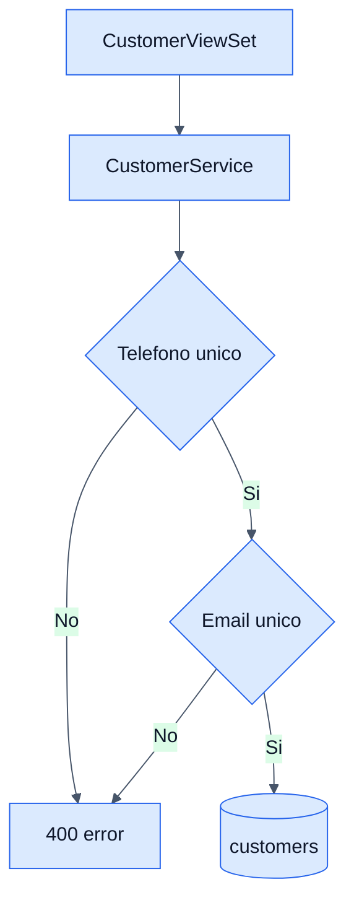

# Customers - Backend

## Objetivo

Documentar la administracion de clientes y su reutilizacion por otras features como ordenes y ecommerce publico.

## Archivos clave

- `backend/crm/customer/apis/views.py`
- `backend/crm/customer/services/services.py`
- `backend/crm/customer/models/models.py`
- `backend/public/views.py`

## Tabla involucrada

### `customers`

- `name`
- `phone` unico
- `email` unico y opcional
- `address`
- `customer_type`
- `created_at`

## Endpoints

- `GET /api/crm/customers/`
- `GET /api/crm/customers/{id}/`
- `POST /api/crm/customers/`
- `PUT/PATCH /api/crm/customers/{id}/`
- `DELETE /api/crm/customers/{id}/`

## Reglas de negocio

- El nombre y el telefono no pueden quedar vacios.
- El telefono es unico.
- El correo, si existe, tambien es unico.
- Los filtros del listado incluyen texto y rango de fechas de creacion.
- El checkout publico puede buscar o crear clientes por telefono.

## Reutilizacion desde ecommerce

- `PublicOrderCreateView` hace `get_or_create(phone=customer_phone)`.
- Si ya existe, reutiliza el cliente.
- Si no existe, crea uno nuevo tipo `RETAIL`.

## Diagrama

