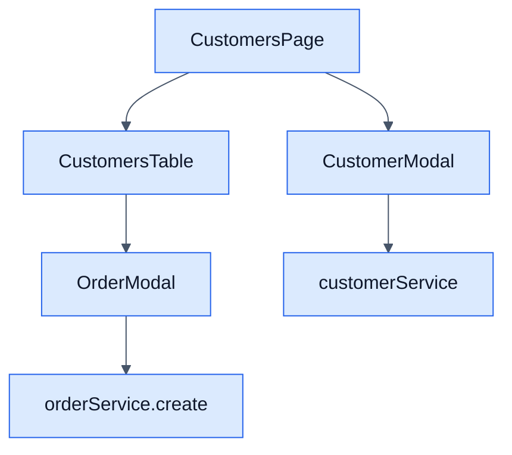

# Customers - Frontend

## Objetivo

Documentar la pantalla CRM de clientes y su puente hacia la creacion de pedidos.

## Archivos clave

- `frontend/src/modules/crm/customers/CustomersPage.jsx`
- `frontend/src/modules/crm/customers/services/customerService.js`
- `frontend/src/modules/crm/customers/hooks/useCustomers.js`
- `frontend/src/modules/crm/customers/components/CustomerModal.jsx`
- `frontend/src/modules/crm/customers/components/CustomersTable.jsx`
- `frontend/src/modules/orders/orders/components/OrderModal.jsx`

## Responsabilidades

- Buscar clientes y filtrar por fechas.
- Crear y editar clientes desde modal.
- Eliminar clientes con confirmacion.
- Lanzar la creacion rapida de un pedido desde un cliente existente.

## Reglas de UI

- La tabla permite `Nuevo pedido` por fila cuando `onCreateOrder` esta disponible.
- `OrderModal` usa el cliente seleccionado como punto de partida.
- Los errores del backend se presentan con `AppAlert`.

## Diagrama

