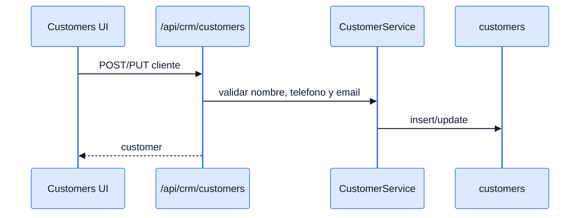
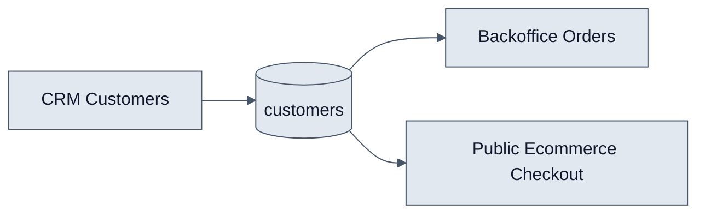

# Customers - Interaccion Frontend y Backend

## Objetivo

Explicar como el modulo CRM administra clientes y como esos registros alimentan pedidos internos y publicos.

## Interaccion end-to-end

1. `CustomersPage` lista clientes desde `/api/crm/customers/`.
2. `CustomerModal` crea o actualiza registros via `customerService`.
3. Desde la tabla se puede abrir `OrderModal` para crear un pedido asociado.
4. En ecommerce, `POST /api/public/orders/` puede reutilizar el mismo cliente por telefono.

## Diagramas

