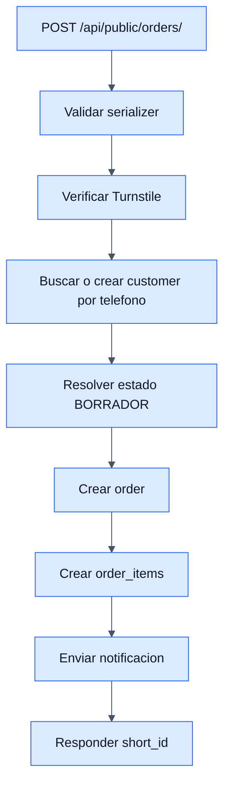

# Ecommerce - Backend

## Objetivo

Documentar la capa backend del flujo publico: catalogo, detalle de producto, filtros y creacion de pedido desde checkout.

## Archivos clave

- `backend/public/urls.py`
- `backend/public/views.py`
- `backend/public/serializers.py`
- `backend/public/throttling.py`
- `backend/public/services/turnstile.py`
- `backend/public/services/notifications.py`

## Endpoints publicos

- `GET /api/public/categories/`
- `GET /api/public/categories/tree/`
- `GET /api/public/categories/{id}/path/`
- `GET /api/public/filters/`
- `GET /api/public/products/`
- `GET /api/public/products/{id}/`
- `POST /api/public/orders/`

## Tablas/modelos involucrados

- `categories`
- `products`
- `product_variants`
- `sizes`
- `colors`
- `uoms`
- `customers`
- `orders`
- `order_items`
- `order_statuses`

## Reglas de negocio del checkout publico

- El endpoint es `AllowAny`.
- Aplica throttling para pedidos publicos.
- Requiere token de Cloudflare Turnstile.
- El cliente se vincula por telefono usando `get_or_create`.
- Si el cliente ya existia, puede actualizar nombre y completar email faltante.
- El estado inicial del pedido publico es `BORRADOR`.
- Los items usan la UOM base del producto.
- Despues de crear la orden se notifica a administradores.

## Alcance real del ecommerce

- Hay catalogo y detalle de producto.
- Hay carrito local y checkout.
- No hay pago en linea.
- No hay cuenta publica del cliente.
- La confirmacion final es manual por WhatsApp o contacto posterior.

## Diagrama

