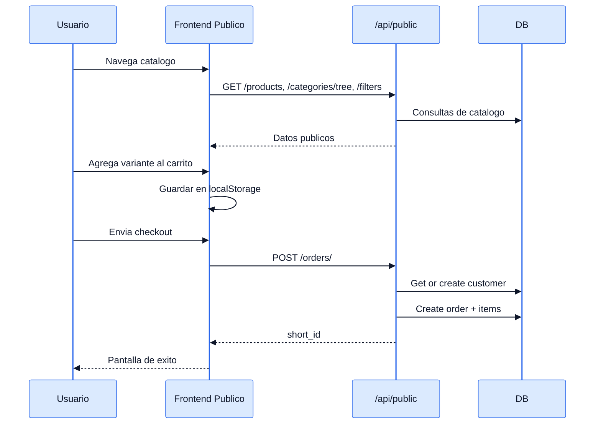
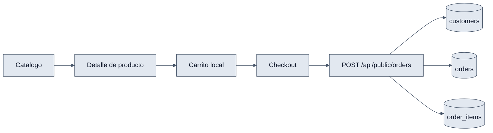

# Ecommerce - Interaccion Frontend y Backend

## Objetivo

Explicar el flujo completo de la tienda publica, desde el catalogo hasta la creacion del pedido.

## Payload tipico de checkout

```json
{
  "customer_name": "Juan Perez",
  "customer_phone": "+50255551234",
  "customer_email": "juan@example.com",
  "shipping_address": "Zona 10",
  "notes": "Entregar en recepcion",
  "turnstile_token": "token",
  "items": [
    {
      "variant_id": 7,
      "quantity": 2
    }
  ]
}
```

## Interaccion end-to-end

1. `CatalogPage` consulta productos, categorias y filtros del backend publico.
2. `ProductDetailPage` obtiene el detalle y agrega variantes al carrito local.
3. `CartDrawer` dirige al checkout.
4. `CheckoutPage` arma el payload y usa `publicService.createOrder(...)`.
5. `PublicOrderCreateView` valida Turnstile y el payload.
6. El backend busca o crea el `Customer` por telefono.
7. Se crea `Order` con estado `BORRADOR` y luego los `OrderItem`.
8. El backend devuelve `short_id` y el frontend muestra confirmacion.

## Diagramas




