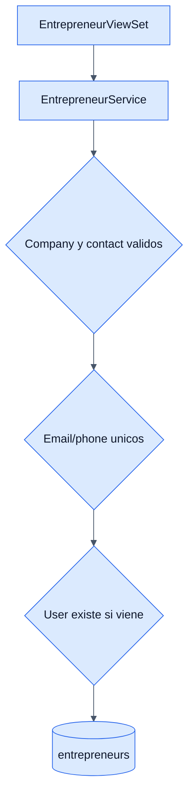

# Entrepreneurs - Backend

## Objetivo

Documentar la gestion de emprendedores y su relacion con usuarios y productos.

## Archivos clave

- `backend/crm/entrepreneur/apis/views.py`
- `backend/crm/entrepreneur/services/services.py`
- `backend/crm/entrepreneur/models/models.py`

## Tabla involucrada

### `entrepreneurs`

- `user_id` opcional
- `company_name`
- `contact_name`
- `phone`
- `email`
- `created_at`

## Endpoints

- `GET /api/crm/entrepreneurs/`
- `GET /api/crm/entrepreneurs/{id}/`
- `POST /api/crm/entrepreneurs/`
- `PUT/PATCH /api/crm/entrepreneurs/{id}/`
- `DELETE /api/crm/entrepreneurs/{id}/`
- `GET /api/crm/entrepreneurs/users/`

## Reglas de negocio

- `company_name` y `contact_name` son obligatorios.
- `email` es unico si se envia.
- `phone` es unico si se envia.
- `user_id` es opcional, pero si se envia debe existir.
- El emprendedor se vincula a productos para exponer la informacion comercial.

## Nota importante

- El endpoint `users/` existe para poblar el dropdown del frontend.
- Su implementacion actual consulta campos tipo `username`, `first_name` y `last_name`, aunque el modelo custom `User` usa `name`.

## Diagrama

