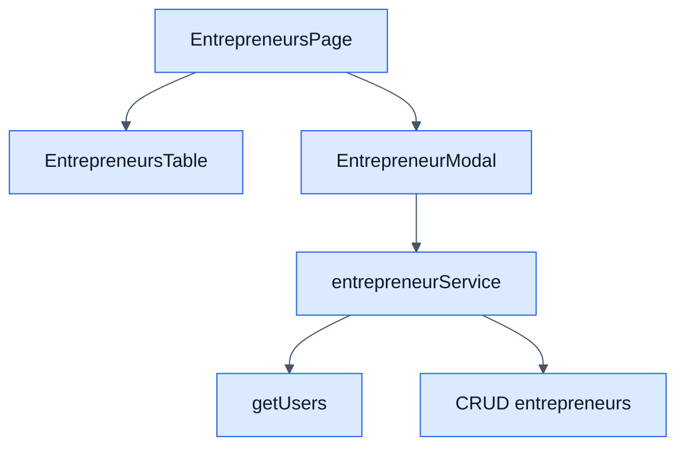

# Entrepreneurs - Frontend

## Objetivo

Documentar la pantalla CRM para administrar emprendedores y vincularlos opcionalmente a usuarios del sistema.

## Archivos clave

- `frontend/src/modules/crm/entrepreneurs/EntrepreneursPage.jsx`
- `frontend/src/modules/crm/entrepreneurs/services/entrepreneurService.js`
- `frontend/src/modules/crm/entrepreneurs/hooks/useEntrepreneurs.js`
- `frontend/src/modules/crm/entrepreneurs/components/EntrepreneurModal.jsx`
- `frontend/src/modules/crm/entrepreneurs/components/EntrepreneursTable.jsx`

## Responsabilidades

- Buscar emprendedores y filtrar por rango de fechas.
- Crear, editar y eliminar emprendedores.
- Cargar usuarios disponibles para el dropdown del modal.

## Reglas de UI

- El modal acepta `user_id` opcional.
- La tabla muestra relacion con usuario cuando existe.
- Los errores del backend se muestran con `AppAlert`.

## Diagrama

