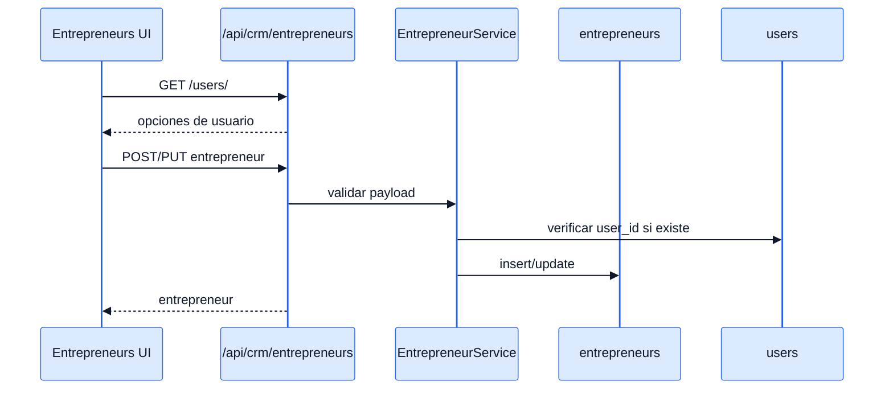
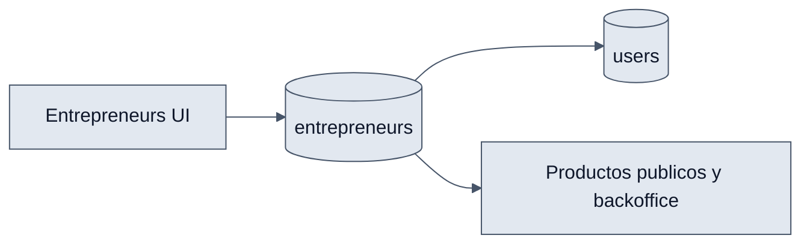

# Entrepreneurs - Interaccion Frontend y Backend

## Objetivo

Explicar como se administra el catalogo de emprendedores y como se vincula al ecosistema del ERP.

## Interaccion end-to-end

1. `EntrepreneursPage` consulta `/api/crm/entrepreneurs/`.
2. El hook tambien recupera usuarios disponibles con `/api/crm/entrepreneurs/users/`.
3. `EntrepreneurModal` envia los cambios al backend.
4. `EntrepreneurService` valida unicidad y existencia del usuario.
5. El registro resultante queda disponible para asociarse a productos.

## Diagramas

