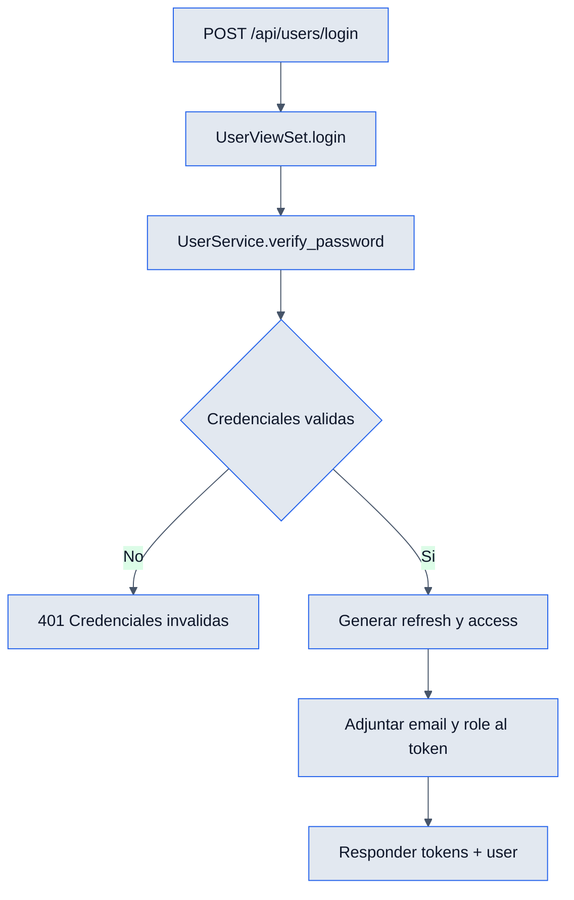

# Login - Backend

## Objetivo

Documentar el flujo de autenticacion del ERP desde el backend: login, validacion del token y control por roles.

## Archivos clave

- `backend/users/urls.py`
- `backend/users/user/apis/views.py`
- `backend/users/user/models/models.py`
- `backend/users/role/models/models.py`
- `backend/users/user/services/services.py`
- `backend/users/authentication.py`
- `backend/users/permissions.py`

## Tablas involucradas

### `users`

- Guarda `role`, `name`, `email`, `password_hash`, `is_active`.
- El modelo expone `is_authenticated = True` para convivir con DRF.

### `roles`

- Catalogo de roles usados por permisos y redireccion del dashboard.

## Endpoints

### `POST /api/users/login/`

- Entrada: `email`, `password`.
- Valida credenciales con el servicio de usuarios.
- Respuesta: `access`, `refresh`, `user`.
- Si falla, devuelve error de credenciales o datos faltantes.

### `GET /api/users/users/me/`

- Requiere token Bearer valido.
- Devuelve el usuario autenticado.
- El frontend lo usa para rehidratar sesion y detectar usuarios bloqueados.

### Endpoints protegidos relacionados

- `GET /api/users/users/`
- `POST /api/users/users/`
- `GET /api/users/users/{id}/`
- `PUT/PATCH /api/users/users/{id}/`
- `PATCH /api/users/users/{id}/toggle_active/`

## Reglas de negocio

- El login esta abierto con `AllowAny`.
- El resto del `UserViewSet` usa `IsAuthenticated` + `HasRole`.
- La sesion depende de JWT emitido por `simplejwt`.
- Al token se le agrega `email` y `role` en el payload.
- Si el usuario no existe, no coincide la contrasena o esta inactivo, el flujo no autentica.

## Flujo interno

1. El cliente hace `POST /api/users/login/`.
2. `UserViewSet.login` obtiene `email` y `password`.
3. `user_service.verify_password(...)` valida hash y estado del usuario.
4. Si es valido, se construyen `refresh` y `access`.
5. El backend devuelve tokens y el `UserSerializer`.
6. En peticiones futuras, la autenticacion custom resuelve el usuario desde el token.

## Diagrama

