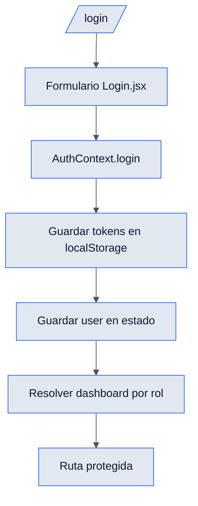

# Login - Frontend

## Objetivo

Documentar la pantalla de acceso y la gestion local de sesion desde React.

## Archivos clave

- `frontend/src/modules/Auth/pages/Login.jsx`
- `frontend/src/core/auth/AuthContext.jsx`
- `frontend/src/core/auth/ProtectedRoute.jsx`
- `frontend/src/core/registry/dashboardPaths.js`

## Responsabilidades del frontend

### `Login.jsx`

- Renderiza el formulario de correo y contrasena.
- Llama a `login(email, password)` del contexto.
- Redirige al dashboard segun `user.role.name`.
- Muestra errores de credenciales.

### `AuthContext.jsx`

- Centraliza `user`, `loading`, `login`, `logout`, `hasRole`.
- Guarda `access_token`, `refresh_token` y `user` en `localStorage`.
- Al iniciar la app, intenta validar sesion con `GET /users/users/me/`.
- Si el token ya no sirve, limpia almacenamiento local.

### `ProtectedRoute`

- Bloquea rutas segun roles permitidos.
- Se combina con la redireccion del dashboard dinamico.

## Flujo visible

1. El usuario entra a `/login`.
2. Completa correo y contrasena.
3. El formulario llama a `AuthContext.login`.
4. Si el backend responde bien, se persisten tokens.
5. La app navega a `/dashboard/admin`, `/dashboard/manager` o `/dashboard/visitor`.
6. En recargas posteriores, la sesion se restituye desde el token actual.

## Reglas de UI

- El submit muestra estado `loading`.
- Si el backend responde con error, se toma `err.response.data.error`.
- El usuario solo ve las rutas permitidas para su rol.

## Diagrama

