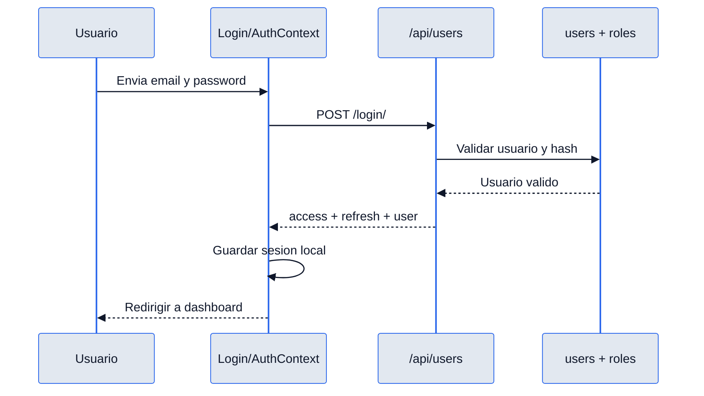
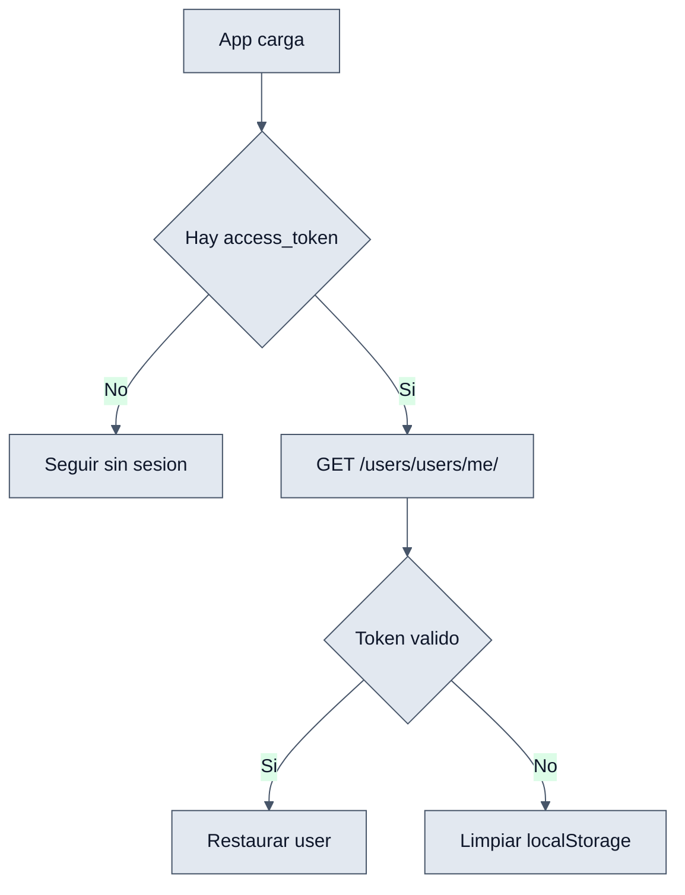

# Login - Interaccion Frontend y Backend

## Objetivo

Explicar como ambas capas colaboran para abrir sesion, restaurarla y proteger rutas.

## Contrato principal

### Request

```json
{
  "email": "admin@erp.local",
  "password": "secret"
}
```

### Response exitosa

```json
{
  "refresh": "jwt-refresh",
  "access": "jwt-access",
  "user": {
    "id": 1,
    "name": "Admin",
    "email": "admin@erp.local",
    "role": {
      "id": 1,
      "name": "ADMIN"
    }
  }
}
```

## Interaccion end-to-end

1. `Login.jsx` captura las credenciales.
2. `AuthContext.login` hace `POST /api/users/login/`.
3. `UserViewSet.login` valida al usuario.
4. El backend entrega tokens y datos del usuario.
5. El frontend guarda la sesion en `localStorage`.
6. En el arranque, `AuthContext` hace `GET /api/users/users/me/` con el token.
7. Si falla la validacion, el frontend limpia sesion y fuerza nuevo login.

## Diagramas




