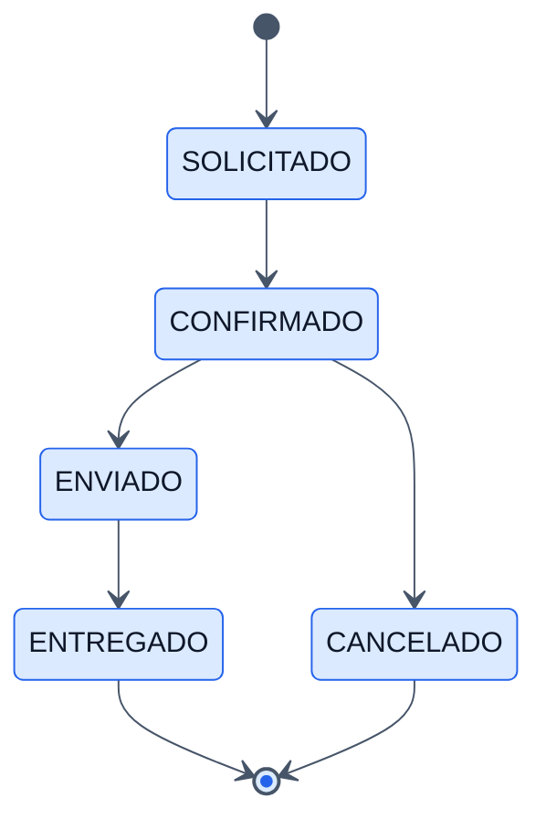

# Order Statuses - Backend

## Objetivo

Documentar el catalogo de estados y el workflow transaccional de las ordenes.

## Archivos clave

- `backend/orders/order_status/apis/views.py`
- `backend/orders/order_status/services/services.py`
- `backend/orders/order_status/models/models.py`
- `backend/orders/order_history/models/models.py`
- `backend/orders/order_history/repositories/repositories.py`

## Tablas involucradas

### `order_statuses`

- Catalogo de estados con `name` y `description`.

### `order_status_history`

- Guarda cambios de estado por orden, actor y notas.

## Endpoints

- `GET /api/orders/statuses/`
- `GET /api/orders/statuses/{id}/`
- `GET /api/orders/statuses/transitions/`
- `POST /api/orders/statuses/transition/`

## Restricciones expuestas por API

- Crear, editar y eliminar estados esta deshabilitado desde la API.
- El frontend solo puede listar estados y ejecutar transiciones.

## Workflow implementado

- `SOLICITADO -> CONFIRMADO`
- `CONFIRMADO -> ENVIADO`
- `CONFIRMADO -> CANCELADO`
- `ENVIADO -> ENTREGADO`
- `ENTREGADO` y `CANCELADO` son terminales.

## Reglas de negocio

- No se puede transicionar si la orden no existe.
- No se puede transicionar desde un estado terminal.
- No se puede repetir el mismo estado.
- Si el salto no esta en `allowed_transitions`, se rechaza.
- Confirmar una orden genera salidas de inventario.
- Cancelar una orden confirmada repone inventario.
- Cada cambio se registra en historial.

## Diagrama

