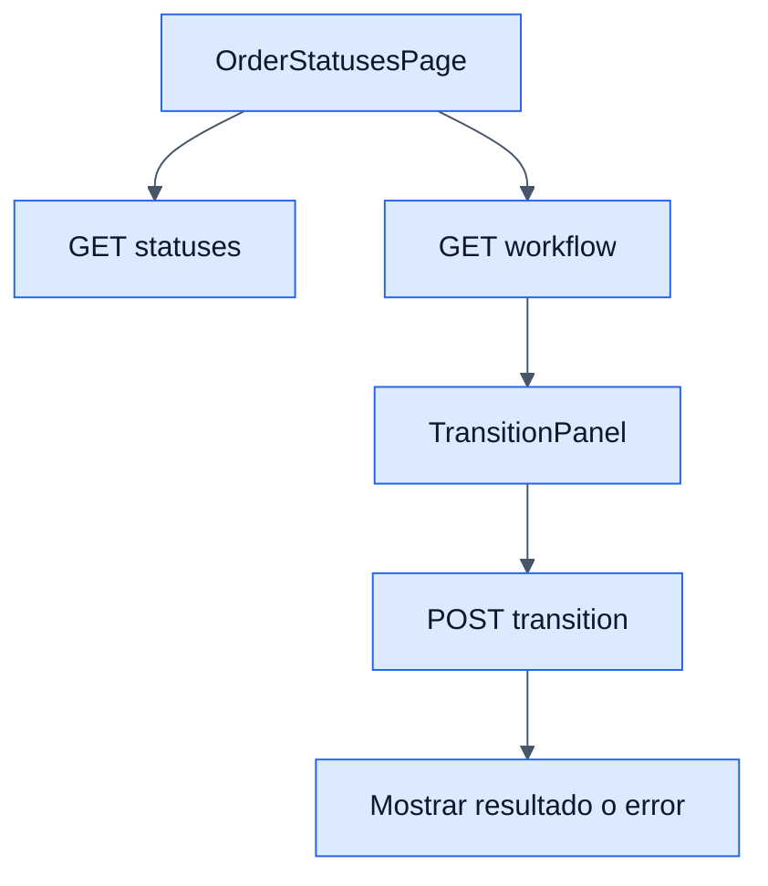

# Order Statuses - Frontend

## Objetivo

Documentar la pantalla de consulta del workflow y la ejecucion manual de transiciones desde el ERP.

## Archivos clave

- `frontend/src/modules/orders/orderStatuses/OrderStatusesPage.jsx`
- `frontend/src/modules/orders/orderStatuses/services/orderStatusesService.js`
- `frontend/src/modules/orders/orderStatuses/hooks/useOrderStatuses.js`
- `frontend/src/modules/orders/orderStatuses/components/TransitionPanel.jsx`
- `frontend/src/modules/orders/orderStatuses/components/OrderStatusesTable.jsx`

## Responsabilidades

### `OrderStatusesPage.jsx`

- Carga catalogo de estados.
- Carga el workflow actual.
- Permite ejecutar una transicion puntual desde `TransitionPanel`.
- Presenta la tabla como catalogo de solo lectura.

### `orderStatusesService`

- `list({ search })`
- `workflow()`
- `transition(payload)`

## Reglas de UI

- El usuario no puede crear ni editar estados desde esta pantalla.
- La pantalla informa que el catalogo es de solo lectura.
- El panel de transicion depende del workflow recuperado desde backend.

## Flujo visible

1. La vista carga estados y workflow.
2. El usuario revisa transiciones permitidas.
3. Si ejecuta una transicion, el frontend envia `order_id` y `target_status`.
4. Si el backend responde bien, la UI refresca el contexto del flujo.

## Diagrama

