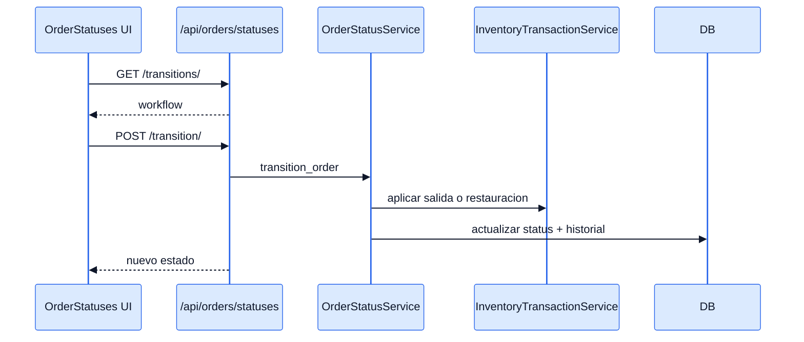
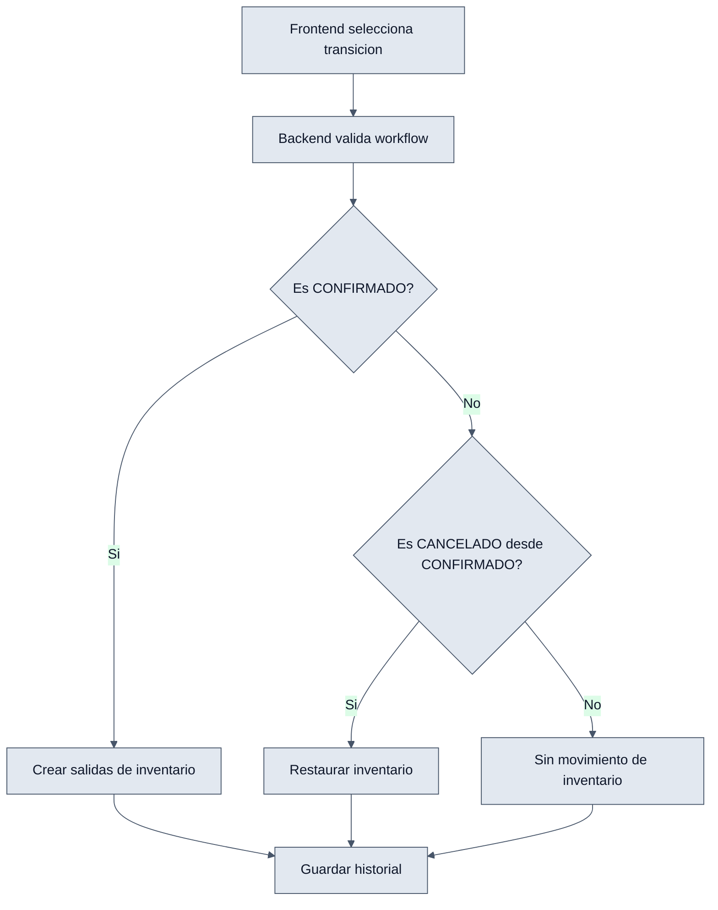

# Order Statuses - Interaccion Frontend y Backend

## Objetivo

Explicar como la UI usa el workflow del backend para ejecutar transiciones validas y con efecto en inventario.

## Payload de transicion

```json
{
  "order_id": 15,
  "target_status": "CONFIRMADO",
  "notes": "Validado por telefono"
}
```

## Interaccion end-to-end

1. El frontend consulta `GET /api/orders/statuses/transitions/`.
2. Con esa respuesta decide que acciones mostrar.
3. Al confirmar una accion, hace `POST /api/orders/statuses/transition/`.
4. `OrderStatusService.transition_order(...)` valida el salto.
5. Si aplica, genera movimientos de inventario y escribe historial.
6. El backend responde con `order_id`, `order_short_id` y nuevo estado.

## Diagramas




