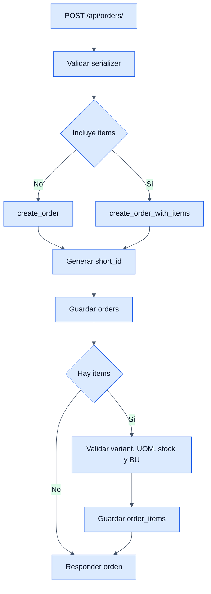

# Orders - Backend

## Objetivo

Documentar la gestion de ordenes del backoffice: creacion, consulta, actualizacion, eliminacion y construccion atomica con items.

## Archivos clave

- `backend/orders/order/apis/views.py`
- `backend/orders/order/services/services.py`
- `backend/orders/order/models/models.py`
- `backend/orders/order_item/models/models.py`
- `backend/orders/order_item/services/services.py`
- `backend/orders/order/serializers/serializers.py`

## Tablas involucradas

### `orders`

- `short_id`
- `customer_id`
- `payment_method_id`
- `status_id`
- `shipping_address`
- `shipping_cost`
- `notes`

### `order_items`

- Relaciona la orden con `variant`, UOM seleccionada, UOM base, cantidades y precios.

## Endpoints

- `GET /api/orders/`
- `POST /api/orders/`
- `GET /api/orders/{id}/`
- `PUT/PATCH /api/orders/{id}/`
- `DELETE /api/orders/{id}/`
- `GET /api/orders/catalogs/`

## Reglas de negocio principales

- Las ordenes usan `short_id` diario tipo `ORD-YYMMDD-00001`.
- Si no se envia estado, el servicio busca `SOLICITADO`; si no existe, usa `BORRADOR`.
- `POST /api/orders/` soporta dos formas:
  - solo cabecera de orden
  - orden completa con `items`
- Si llegan items, la creacion es atomica.
- Solo se pueden eliminar ordenes en estado `SOLICITADO`.

## Reglas de items al crear una orden completa

- Cada item debe incluir `variant_id`, `quantity`, `selected_uom`.
- La cantidad debe ser mayor a cero.
- La variante debe existir y estar activa.
- Debe existir conversion hacia la UOM base si la UOM elegida no coincide.
- El stock se valida en cantidad base.
- No se permite repetir la misma variante en la misma orden.
- No se permiten variantes de distintas unidades de negocio en una misma orden.

## Flujo interno

1. `OrderAPIView.post` valida el payload.
2. Si no hay items, usa `OrderService.create_order`.
3. Si hay items, usa `OrderService.create_order_with_items`.
4. El servicio genera `short_id` unico.
5. `OrderItemService` valida stock, conversiones y consistencia.
6. El backend responde con la orden serializada.

## Diagrama

