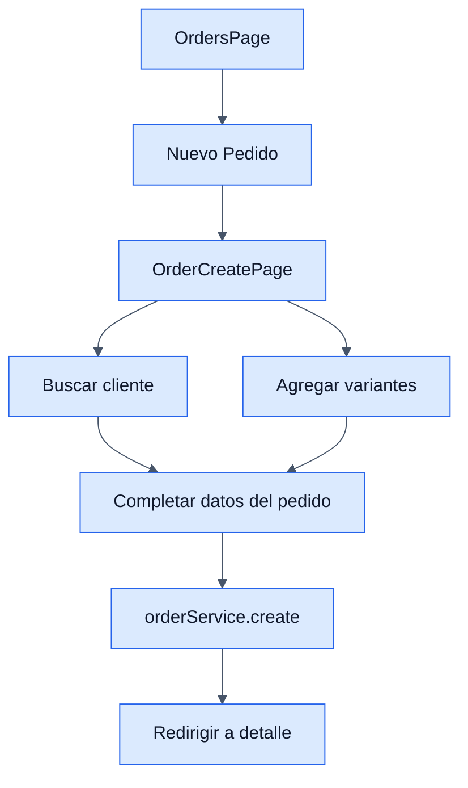

# Orders - Frontend

## Objetivo

Documentar el modulo visual de pedidos del backoffice y el flujo de creacion desde catalogo interno.

## Archivos clave

- `frontend/src/modules/orders/orders/OrdersPage.jsx`
- `frontend/src/modules/orders/orders/OrderCreatePage.jsx`
- `frontend/src/modules/orders/orders/services/orderService.js`
- `frontend/src/modules/orders/orders/hooks/useOrders.js`
- `frontend/src/modules/orders/orders/hooks/useVariantCatalog.js`
- `frontend/src/modules/orders/orders/hooks/useOrderCart.js`

## Pantallas

### `OrdersPage.jsx`

- Lista pedidos.
- Permite buscar, paginar, eliminar y cambiar estado.
- Consulta el workflow para mostrar solo transiciones validas.

### `OrderCreatePage.jsx`

- Permite crear un pedido desde variantes activas con stock.
- Usa un carrito interno separado del ecommerce publico.
- Permite seleccionar cliente, metodo de pago, direccion, costo de envio y notas.

## Servicios HTTP

### `orderService`

- `list()`
- `get(id)`
- `catalogs()`
- `create(payload)`
- `update(id, payload)`
- `remove(id)`

## Reglas de UI

- No se puede enviar el pedido si no hay cliente o no hay items.
- Los metodos de pago se cargan desde `GET /api/orders/catalogs/`.
- Tras crear la orden, el frontend navega al detalle y limpia el carrito interno.
- En el listado, las acciones visibles dependen del estado actual del pedido y del workflow.

## Flujo visible

1. El usuario entra al listado de pedidos.
2. Puede crear uno nuevo desde el catalogo de variantes.
3. Selecciona cliente y agrega variantes al carrito interno.
4. El frontend arma el payload de orden con items.
5. Si el backend responde bien, redirige al detalle.

## Diagrama

