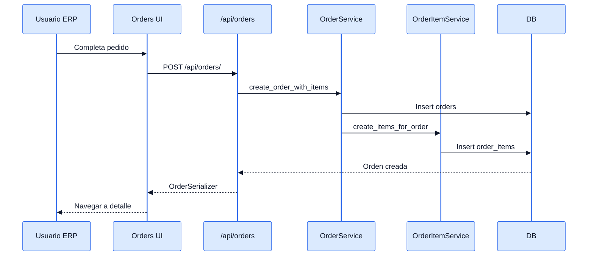
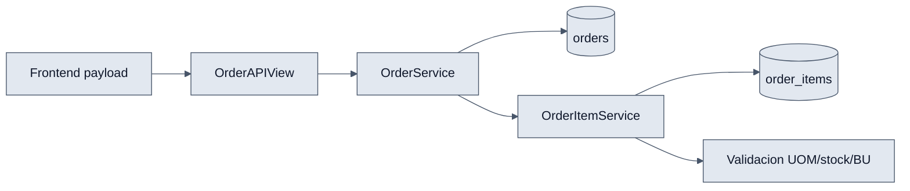

# Orders - Interaccion Frontend y Backend

## Objetivo

Explicar el flujo completo del backoffice al crear y administrar pedidos.

## Payload tipico de creacion

```json
{
  "customer_id": 10,
  "payment_method_id": 2,
  "shipping_address": "Zona 1",
  "shipping_cost": 25,
  "notes": "Llamar antes de entregar",
  "items": [
    {
      "variant_id": 7,
      "quantity": 2,
      "selected_uom_id": 1
    }
  ]
}
```

## Interaccion end-to-end

1. `OrderCreatePage` carga catalogos de clientes y metodos de pago.
2. El usuario construye el carrito interno con variantes.
3. `orderService.create(payload)` llama a `POST /api/orders/`.
4. `OrderAPIView` decide si crea solo la cabecera o cabecera + items.
5. `OrderService` genera `short_id` y persiste la orden.
6. `OrderItemService` valida cada item y lo guarda.
7. El frontend navega al detalle de la nueva orden.

## Diagramas




