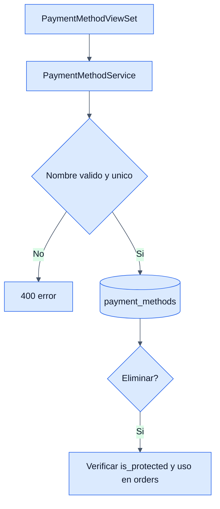

# Payment Methods - Backend

## Objetivo

Documentar el catalogo de metodos de pago usados por las ordenes del ERP.

## Archivos clave

- `backend/orders/payment_method/apis/views.py`
- `backend/orders/payment_method/services/services.py`
- `backend/orders/payment_method/models/models.py`

## Tabla involucrada

### `payment_methods`

- `name`
- `is_active`
- `is_protected`

## Endpoints

- `GET /api/orders/payment-methods/`
- `GET /api/orders/payment-methods/{id}/`
- `POST /api/orders/payment-methods/`
- `PUT/PATCH /api/orders/payment-methods/{id}/`
- `DELETE /api/orders/payment-methods/{id}/`

## Reglas de negocio

- No se permiten nombres vacios ni repetidos.
- Los metodos protegidos no se pueden renombrar ni eliminar.
- Si un metodo esta asociado a ordenes existentes, no se puede eliminar.
- `is_active` define si debe seguir disponible para nuevas ordenes.

## Diagrama

