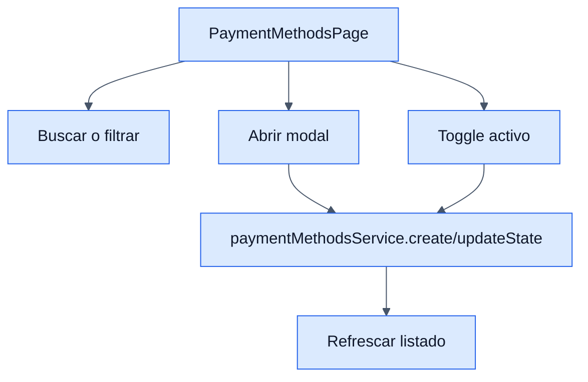

# Payment Methods - Frontend

## Objetivo

Documentar la pantalla de mantenimiento de metodos de pago del backoffice.

## Archivos clave

- `frontend/src/modules/orders/paymentMethods/PaymentMethodsPage.jsx`
- `frontend/src/modules/orders/paymentMethods/services/paymentMethodsService.js`
- `frontend/src/modules/orders/paymentMethods/hooks/usePaymentMethods.js`
- `frontend/src/modules/orders/paymentMethods/components/PaymentMethodsTable.jsx`
- `frontend/src/modules/orders/paymentMethods/components/PaymentMethodModal.jsx`

## Responsabilidades

- Buscar y filtrar por estado.
- Crear un metodo nuevo.
- Editar nombre o activar/desactivar.
- Eliminar con confirmacion.

## Reglas de UI

- `FilterTabs` separa `Todos`, `Activos`, `Inactivos`.
- El toggle de estado abre un `AppAlert` explicando el efecto.
- Los errores del backend se muestran sin ocultar el mensaje real.

## Diagrama

