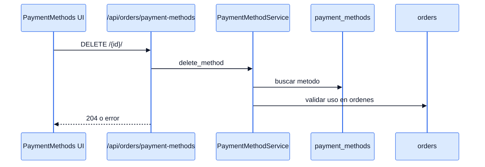
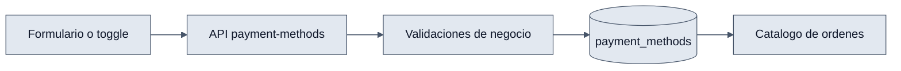

# Payment Methods - Interaccion Frontend y Backend

## Objetivo

Explicar como el modulo visual administra un catalogo que luego es consumido por las ordenes.

## Interaccion end-to-end

1. `PaymentMethodsPage` consulta `GET /api/orders/payment-methods/`.
2. El usuario crea o edita desde `PaymentMethodModal`.
3. El frontend usa `POST` o `PATCH` segun la accion.
4. `PaymentMethodService` valida unicidad y restricciones.
5. Si el usuario intenta eliminar uno protegido o en uso, el backend lo rechaza.
6. La UI muestra el error y mantiene el estado anterior.

## Diagramas

