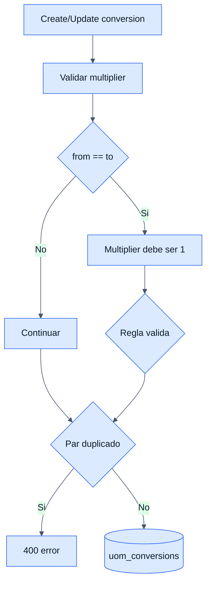

# UOM Conversions - Backend

## Objetivo

Documentar la tabla de conversiones entre UOMs y sus validaciones.

## Archivos clave

- `backend/inventory/uom_conversion/apis/views.py`
- `backend/inventory/uom_conversion/services/services.py`
- `backend/inventory/uom_conversion/models/models.py`

## Tabla involucrada

### `uom_conversions`

- `from_uom_id`
- `to_uom_id`
- `multiplier`
- `unique_together(from_uom, to_uom)`

## Endpoints

- `GET /api/inventory/uom-conversions/`
- `GET /api/inventory/uom-conversions/{id}/`
- `POST /api/inventory/uom-conversions/`
- `PUT /api/inventory/uom-conversions/{id}/`
- `DELETE /api/inventory/uom-conversions/{id}/`

## Reglas de negocio

- El multiplicador debe ser mayor que cero.
- Si origen y destino son la misma UOM, el multiplicador debe ser `1`.
- No se permite duplicar el mismo par `from -> to`.
- Estas conversiones son reutilizadas por ordenes y movimientos de inventario.

## Diagrama

