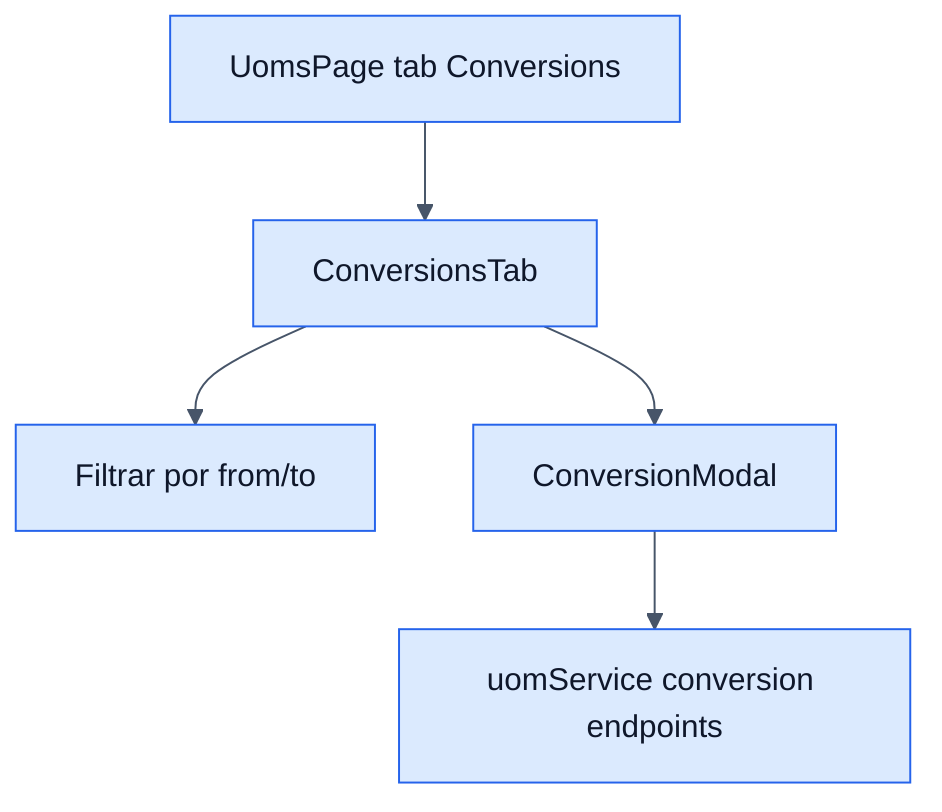

# UOM Conversions - Frontend

## Objetivo

Documentar la pestaña de conversiones que comparte pagina con el catalogo de UOMs.

## Archivos clave

- `frontend/src/modules/products/uoms/UomsPage.jsx`
- `frontend/src/modules/products/uoms/components/ConversionsTab.jsx`
- `frontend/src/modules/products/uoms/components/ConversionModal.jsx`
- `frontend/src/modules/products/uoms/services/uomService.js`

## Responsabilidades

- Mostrar conversiones paginadas.
- Filtrar por `from_uom_id` y `to_uom_id`.
- Crear, editar y eliminar conversiones.
- Reusar la misma capa de errores y confirmaciones de `UomsPage`.

## Servicios HTTP relacionados

- `getConversions(filters)`
- `createConversion(data)`
- `updateConversion(id, data)`
- `deleteConversion(id)`
- `getApplicableConversions(baseUomId)` para otros flujos del ERP

## Diagrama

