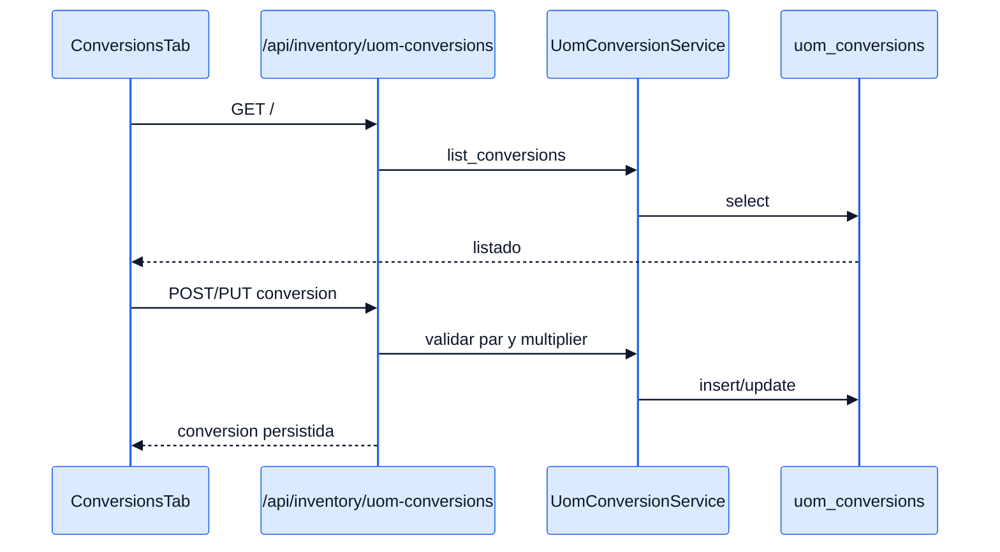
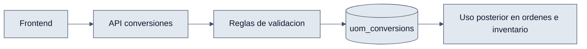

# UOM Conversions - Interaccion Frontend y Backend

## Objetivo

Explicar como el frontend administra conversiones y como el backend las valida antes de persistirlas.

## Interaccion end-to-end

1. `ConversionsTab` consulta `GET /api/inventory/uom-conversions/`.
2. El usuario puede filtrar por UOM origen y destino.
3. `ConversionModal` envia `POST` o `PUT` con `from_uom_id`, `to_uom_id`, `multiplier`.
4. `UomConversionService` valida reglas de negocio.
5. El backend persiste el registro y el frontend actualiza el tab.

## Diagramas

