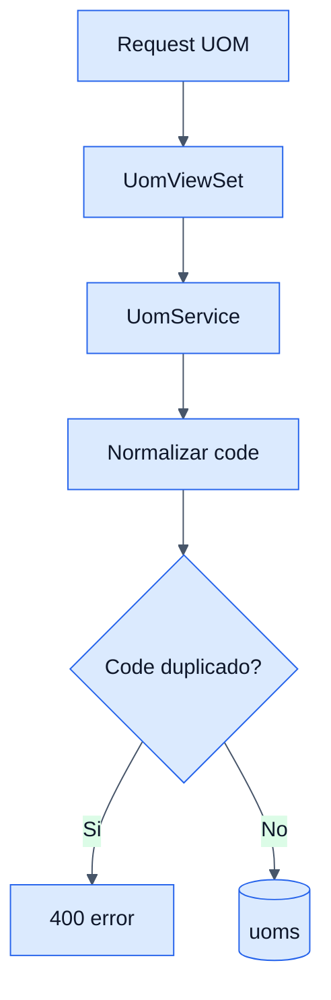

# UOMs - Backend

## Objetivo

Documentar el catalogo de unidades de medida y las reglas de mantenimiento basicas.

## Archivos clave

- `backend/inventory/uom/apis/views.py`
- `backend/inventory/uom/services/services.py`
- `backend/inventory/uom/models/models.py`

## Tabla involucrada

### `uoms`

- `code` unico
- `name`

## Endpoints

- `GET /api/inventory/uoms/`
- `GET /api/inventory/uoms/{id}/`
- `POST /api/inventory/uoms/`
- `PUT /api/inventory/uoms/{id}/`
- `DELETE /api/inventory/uoms/{id}/`

## Reglas de negocio

- Solo `ADMIN` puede administrar UOMs.
- El `code` se normaliza a minusculas.
- No se pueden duplicar codigos.
- No se puede eliminar una UOM que aun participa en conversiones.

## Flujo interno

1. El viewset recibe la peticion.
2. `UomService` normaliza y valida el codigo.
3. El repositorio crea, actualiza o elimina.
4. Si hay conversiones relacionadas, la eliminacion falla.

## Diagrama

