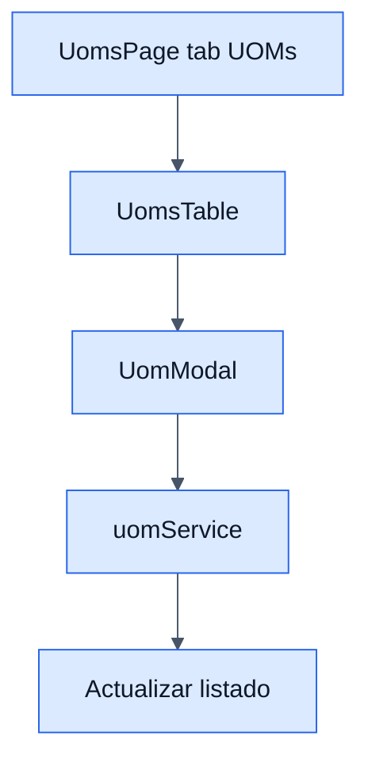

# UOMs - Frontend

## Objetivo

Documentar la pestaña de unidades de medida dentro del modulo visual de UOMs.

## Archivos clave

- `frontend/src/modules/products/uoms/UomsPage.jsx`
- `frontend/src/modules/products/uoms/services/uomService.js`
- `frontend/src/modules/products/uoms/hooks/useUoms.js`
- `frontend/src/modules/products/uoms/components/UomsTable.jsx`
- `frontend/src/modules/products/uoms/components/UomModal.jsx`

## Responsabilidades

### `UomsPage.jsx`

- Centraliza dos tabs: `uoms` y `conversions`.
- Cuando la tab activa es `uoms`, muestra la tabla de unidades.
- Abre el modal para crear o editar una UOM.

### `uomService`

- `getUoms()`
- `createUom(data)`
- `updateUom(id, data)`
- `deleteUom(id)`

## Reglas de UI

- La accion principal cambia segun la tab activa.
- Los errores del backend se muestran con `AppAlert`.
- La lista esta paginada.

## Diagrama

