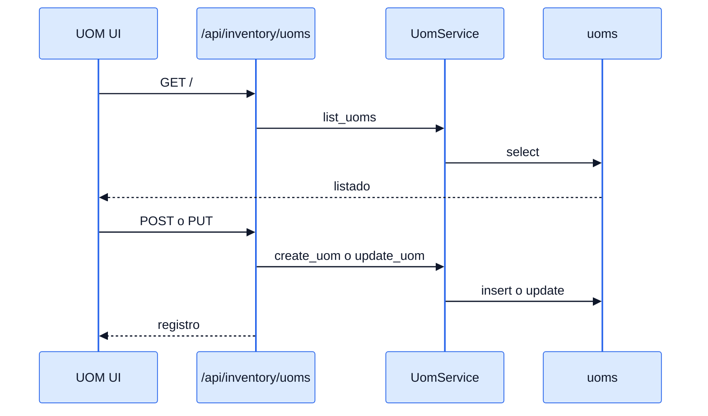
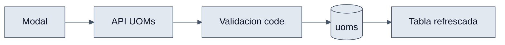

# UOMs - Interaccion Frontend y Backend

## Objetivo

Explicar como el modulo visual mantiene el catalogo de unidades de medida usando los endpoints de inventario.

## Interaccion end-to-end

1. `useUoms` llama `uomService.getUoms()`.
2. El backend devuelve el catalogo paginado.
3. El usuario crea o edita una UOM desde `UomModal`.
4. El frontend envia `POST` o `PUT` a `/api/inventory/uoms/`.
5. `UomService` valida unicidad y normaliza el codigo.
6. La UI refresca la tabla.

## Diagramas

